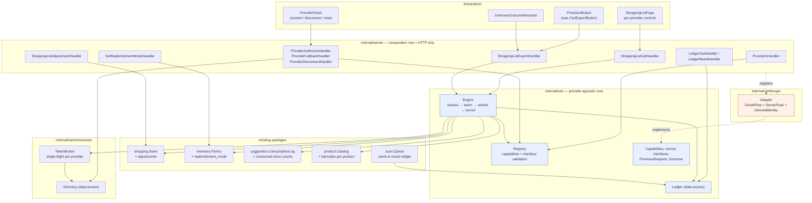
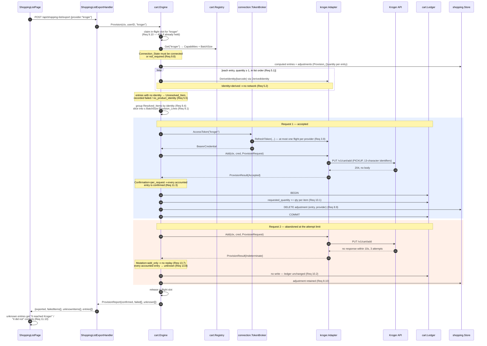

# Design Document

## Overview

This feature replaces the no-op `shopping.CartExporter` with a provider-agnostic provisioning core and one concrete adapter (Kroger). The core reads what a provider declared it can do and degrades accordingly; it never asks a provider for an operation that provider did not declare.

Language: Go for the backend, TypeScript/React for the frontend. Everything stays in the single Go binary against the single SQLite file. No scheduler, no new process.

### Method: why this document is ordered the way it is

The sections below run in this order, deliberately:

1. **Core types first.** The hard part of this feature is not the HTTP calls — it is the shape of a capability record, a provision line, an outcome, and a ledger entry. Every later decision (what the schema looks like, what the engine can even express, what a test can assert) follows from those shapes. Writing the engine first and retrofitting types would bake the wrong access patterns into SQL that is then expensive to move. So each core type below states the **dominant access pattern** that justifies its shape.
2. **What gets deleted, second.** `cart_integrations` is dead, and the `CartExporter` / `ExportItem` / `ExportError` trio encodes an assumption this feature invalidates (that a provisioning result is either "nil error" or "an error"). Removing them before building means the new code is not written to coexist with a shape it replaces. Subtraction precedes scaffolding.
3. **Scaffold third: the contract suite and the fake provider.** These exist before the engine, not after, because they are what makes the abstraction credible. Every provider added after Kroger benefits from a suite that already exists and already covers the capability combinations Kroger does not declare. Written afterwards, a contract suite degenerates into a description of whatever the first adapter happens to do.
4. **Then** the engine, the Kroger adapter, the HTTP surface, and the frontend — each of which is mostly assembly once the three above are settled.

---

## Architecture



The one arrow that matters for layering: `kroger` depends on `cart`, and `cart` depends on nothing in `kroger`. Registration is the only place the two meet, and it happens in `internal/server` — the composition root. Adding a second provider therefore touches one new package plus one registration call, and nothing inside `internal/cart`.

### The central architectural decision: capabilities are data, operations are narrow interfaces

Requirement 1.4 says the engine invokes only the operations a provider declared. There are two ways to honor that.

**Rejected: one fat adapter interface.** Give every adapter a single interface carrying the union of all operations — `AuthorizationURL`, `ExchangeCode`, `RefreshToken`, `Add`, `Update`, `Remove`, `BuildHandoff`, `DeriveIdentity`, `LookUpIdentity` — and have each adapter return `ErrUnsupported` from the ones it does not support. The engine then checks the declared capability before each call.

That satisfies Requirement 1.4 only at runtime, and only for as long as every branch is written correctly. Worse, it lets an adapter **lie**: an adapter can declare `Product_Identity_Capability: derived` and implement `DeriveIdentity` by calling the provider's catalog over the network, and nothing in the type system objects. The requirements' own introduction names this: "A single interface that assumes the union of those behaviors forces every adapter to lie about what it can do."

**Chosen: a capability record plus narrow interfaces, validated at registration.**

- `cart.Capabilities` is a record of five typed enums and is the single declared source of truth (Requirements 1.2, 1.7).
- Adapter behavior is split into **narrow interfaces**, one per operation family: `OAuthFlow`, `StaticCredential`, `ServerPush`, `HandoffBuilder`, `DerivedIdentity`, `LookedUpIdentity`, and — for wider mutation capabilities not yet used — `LineUpdater` and `LineRemover`.
- `Registry.Register` validates that the adapter implements **exactly** the narrow interfaces its declared capabilities require: every required one present, and no interface belonging to a capability value it did not declare. This is where Requirement 1.3 lives, and it fails at startup rather than mid-operation.
- The engine dispatches by type-asserting the narrow interface the declared capability names. An undeclared operation is therefore not merely forbidden — the engine holds no value it could call it through. It is **unreachable**.

The five enums are five distinct named types, not five `string` fields. A `DeliveryCapability` cannot be passed where a `ConfirmationCapability` is expected, so the "rejected dimension" error class of Requirement 1.3 mostly stops existing: a dimension swap is a compile error, and only an out-of-set *value* survives to runtime validation.

**One dimension the type system cannot carry, stated plainly.** `Confirmation_Capability` selects an *interpretation* of a result, not an operation to call: `per_line`, `per_request`, and `none` all go through the same `ServerPush.Add`. There is no interface to omit. So confirmation stays a `switch` on the declared value inside the engine, and the contract suite (Requirement 16.2) is what proves all three branches behave. Pretending otherwise — e.g. inventing three `ServerPush` variants — would add three interfaces to express one decision and would leave `none` indistinguishable from `per_request` at the type level anyway, because both return the same payload.

### One provisioning operation, end to end



Two things the diagram is drawn to make visible. The ledger advance is **inside a transaction that also clears the adjustment**, and that transaction commits **per accepted request**, not per operation. And the unknown path writes *nothing* — no ledger advance, no adjustment clear — which is what makes Requirement 15.5 (no-loss) hold by construction rather than by remembering to skip a write.

---

## Components and Interfaces

### 1. Core types

Data structures first. Each type below states the access pattern that justifies its shape.

#### Provider identity

```go
// ProviderID names one Grocery_Provider. Lowercase, non-empty.
type ProviderID string
```

*Dominant access:* exact-match lookup, three ways — a map key in the registry, an environment-variable namespace (`PANTRY_KROGER_CLIENT_ID`), and a column value in two tables. All three want a plain comparable string, so `ProviderID` is a defined string type rather than a struct: it costs nothing as a map key or a SQL argument, while still refusing to be confused with an item ID or a barcode at a call site.

#### The five capability dimensions

```go
type AuthCapability string
const (
    AuthNone   AuthCapability = "none"
    AuthOAuth2 AuthCapability = "oauth2_authorization_code"
    AuthAPIKey AuthCapability = "api_key"
)

type DeliveryCapability string
const (
    DeliveryServerPush    DeliveryCapability = "server_push"
    DeliveryClientHandoff DeliveryCapability = "client_handoff"
)

type ConfirmationCapability string
const (
    ConfirmPerLine    ConfirmationCapability = "per_line"
    ConfirmPerRequest ConfirmationCapability = "per_request"
    ConfirmNone       ConfirmationCapability = "none"
)

type MutationCapability string
const (
    MutateAddOnly      MutationCapability = "add_only"
    MutateAddAndUpdate MutationCapability = "add_and_update"
    MutateFull         MutationCapability = "full"
)

type IdentityCapability string
const (
    IdentityDerived  IdentityCapability = "derived"
    IdentityLookedUp IdentityCapability = "looked_up"
)
```

Each type carries a `Valid() bool` and a `Dimension() string` (used to fill the rejected-dimension field of a registration error). The string values are exactly the requirement vocabulary, so a value read back from SQL or written to JSON needs no translation table.

*Dominant access:* compared against a closed set once, at registration; read many times per operation; never parsed from request input. That argues for defined string types with `Valid()` rather than integer enums (which would need a parse/format pair for SQL and JSON) and rather than a single `string` per dimension (which would let a dimension swap compile).

#### The capabilities record

```go
// Capabilities is the declared source of truth for what one provider can do.
type Capabilities struct {
    Auth         AuthCapability
    Delivery     DeliveryCapability
    Confirmation ConfirmationCapability
    Mutation     MutationCapability
    Identity     IdentityCapability
}

func (c Capabilities) Validate() error   // every dimension present and in-set
```

*Dominant access:* read, never written, once per operation step. A flat value struct with no pointers and no maps means the copy the engine holds cannot be mutated behind the registry's back, and `Capabilities` can be compared with `==` — which the contract suite's coverage table relies on.

#### Narrow adapter interfaces

```go
// Provider is what every adapter implements, whatever its capabilities.
type Provider interface {
    ID() ProviderID
    DisplayName() string
    Capabilities() Capabilities
}

// OAuthFlow is required exactly when Auth == AuthOAuth2, and forbidden otherwise.
type OAuthFlow interface {
    AuthorizationScope() string
    AuthorizationURL(state string) (string, error)
    ExchangeCode(ctx context.Context, code string) (TokenSet, error)
    RefreshAccessToken(ctx context.Context, refreshToken string) (TokenSet, error)
}

// StaticCredential is required exactly when Auth == AuthAPIKey.
type StaticCredential interface {
    Credential() Credential
}

// ServerPush is required exactly when Delivery == DeliveryServerPush.
type ServerPush interface {
    Add(ctx context.Context, cred Credential, req ProvisionRequest) (ProvisionResult, error)
}

// HandoffBuilder is required exactly when Delivery == DeliveryClientHandoff.
type HandoffBuilder interface {
    BuildHandoff(req ProvisionRequest) (HandoffArtifact, error)
}

// DerivedIdentity is required exactly when Identity == IdentityDerived. It takes
// no context and no credential, which is how "sends no request while deriving"
// (Requirement 5.2) becomes a signature guarantee rather than a promise.
type DerivedIdentity interface {
    DeriveIdentity(barcode string) (ProductIdentity, bool)
}

// LookedUpIdentity is required exactly when Identity == IdentityLookedUp.
type LookedUpIdentity interface {
    LookUpIdentity(ctx context.Context, cred Credential, barcode string) (ProductIdentity, bool, error)
}

// LineUpdater is required when Mutation is add_and_update or full;
// LineRemover additionally when Mutation is full. Neither is declared by Kroger,
// so an add_only adapter is never handed to code that could call them
// (Requirement 9.11 becomes unreachable, not merely forbidden).
type LineUpdater interface {
    UpdateLine(ctx context.Context, cred Credential, line ProvisionLine) (ProvisionResult, error)
}
type LineRemover interface {
    RemoveLine(ctx context.Context, cred Credential, identity ProductIdentity) (ProvisionResult, error)
}
```

`DerivedIdentity.DeriveIdentity` having no `context.Context` parameter is the single highest-value signature choice in this list. A function that cannot receive a context cannot make a well-formed outbound HTTP call in this codebase, so Requirement 5.2 is enforced by the shape of the method rather than by a reviewer noticing.

#### Credential

```go
// Credential applies one provider's authentication to an outbound request.
type Credential interface {
    Apply(req *http.Request)
    String() string // always redacted
}

type NoCredential struct{}
type BearerCredential struct{ token string }
type HeaderCredential struct{ name, value string }
```

*Dominant access:* constructed once per request, applied once, never inspected. The secret lives in an unexported field with no getter, and `String()` returns `"bearer(redacted)"`. Requirement 14.3 (omit token values from logs) therefore holds even for a careless `log.Printf("%v", cred)` — the leak is unrepresentable rather than remembered.

#### Provision request, line, and resolved item

```go
// ProductIdentity is a provider's own identifier for one pantry product.
// Non-empty by construction at the resolution boundary.
type ProductIdentity string

// ResolvedItem is one shopping list entry paired with the identity resolved for
// its product and the quantity that entry contributes.
type ResolvedItem struct {
    EntryID  string
    ItemID   string
    Name     string
    Identity ProductIdentity
    Quantity int // 1..999
}

// ProvisionLine is one identity/quantity pair submitted to a provider.
type ProvisionLine struct {
    Identity ProductIdentity
    Quantity int               // 1..999, the clamped sum over Accounts
    Options  map[string]string // only keys the provider declares
    Accounts []ResolvedItem    // never empty; len > 1 when entries share an identity
}

// ProvisionRequest carries 1..BatchSize lines to exactly one provider.
type ProvisionRequest struct {
    Provider ProviderID
    Lines    []ProvisionLine
}
```

*Dominant access for `Accounts`:* after the provider answers, the engine must walk from one line's result back to every entry that line accounted for, to record an outcome per entry (Requirements 11.2, 11.3) and to advance one ledger row per item (Requirement 10.1). Carrying the resolved items **on the line** makes that a field read instead of a re-derivation, and it means Requirement 9.4 (two entries sharing one identity collapse into one line carrying the summed quantity) loses neither entry. The alternative — a side map from identity to entries — breaks the moment two entries with the same identity land in different batches.

`Options` is a `map[string]string` rather than a typed per-provider struct because the engine must validate it against the declared option set without knowing any provider's option names (Requirement 15.2). The adapter re-reads it into its own typed shape at the serialization boundary, where Kroger's `PICKUP`/`DELIVERY` check lives (Requirement 17.12).

#### Provision result and outcome

```go
// ProvisionResult is what one adapter reports for one request. Indeterminate is
// a first-class value, not an error, because Requirement 13.7 needs a timeout
// under add_only to be distinguishable from a rejection.
type ProvisionResult struct {
    Disposition ResultDisposition        // Accepted | Rejected | Indeterminate
    PerLine     map[ProductIdentity]bool // populated only when Confirmation == per_line
    Status      int                      // provider HTTP status, for the error message
}

type Outcome string
const (
    OutcomeConfirmed Outcome = "confirmed"
    OutcomeFailed    Outcome = "failed"
    OutcomeUnknown   Outcome = "unknown"
)

// OutcomeReason is the "exactly one reason" of Requirement 11.7.
type OutcomeReason string
const (
    ReasonNoProductIdentity OutcomeReason = "no_product_identity"
    ReasonProviderRejected  OutcomeReason = "provider_rejected"
    ReasonRequestIncomplete OutcomeReason = "request_incomplete"
    ReasonNoPerItemResult   OutcomeReason = "no_per_item_result"
)

type EntryOutcome struct {
    EntryID string
    ItemID  string
    Name    string
    Quantity int
    Outcome Outcome
    Reason  OutcomeReason
}

// ProvisionReport is what a Provision_Operation returns. A partially failed
// operation is a normal return value here, not an error — which is the defect in
// the shape it replaces.
type ProvisionReport struct {
    Provider  ProviderID
    Confirmed int
    Entries   []EntryOutcome // failed and unknown only (Requirement 11.7)
    Handoff   *HandoffArtifact
}
```

`OutcomeUnknown` being a named enum value rather than an absent confirmation is what gives Requirement 11.10's two UI controls something to bind to, and what lets Requirement 11.11's "the owner says it did reach the provider" be an ordinary ledger advance rather than a special case.

#### Ledger entry

```go
// LedgerEntry is what Pantry believes it has already requested from one provider
// for one pantry product, and the boundary that belief is measured from.
type LedgerEntry struct {
    Provider  ProviderID
    ItemID    string
    Requested int       // >= 0
    Boundary  time.Time // UTC
}
```

*Dominant access:* **every entry for one provider, read at once.** Computing a shopping list needs the ledger row for every candidate item in a single pass (Requirement 7.3), so the data-access method is

```go
func (l *Ledger) ListForProvider(ctx context.Context, p ProviderID) (map[string]LedgerEntry, error)
```

— one query, then O(1) per entry — not a per-item read inside the entry loop. That access pattern is why the table's primary key is ordered `(provider_id, item_id)`: the provider prefix makes the read a range scan. A missing key in the returned map is the "no entry exists" case of Requirement 7.8, and the caller resolves it to `Requested: 0` with a boundary preceding every consumption event, so no absent-row branch leaks into the quantity arithmetic.

#### Connection record

```go
type ConnectionState string
const (
    StateNotRequired   ConnectionState = "not_required"
    StateConnected     ConnectionState = "connected"
    StateReauthRequired ConnectionState = "reauth_required"
    StateDisconnected  ConnectionState = "disconnected"
)

// Connection is server-side only. No JSON tags: this type is never marshalled.
type Connection struct {
    Provider     ProviderID
    State        ConnectionState
    AccessToken  string
    RefreshToken string
    ExpiresAt    *time.Time
    AuthState    string
    AuthStateAt  *time.Time
}
```

Requirement 14.2 is satisfied by a **separate response type** that has no token, expiry, or auth-state fields at all. There is nothing to remember to omit, because there is nothing to omit.

### 2. What gets deleted

#### `cart_integrations` — dropped, not altered

No Go file references this table. Its only mention outside migration 001 is the expected-table list in `internal/app/migrate_test.go`. It is dead code, and it is also *wrongly shaped* for this feature: `user_id TEXT NOT NULL UNIQUE` permits exactly one row per user, so it can hold the connection state of exactly one provider, while the presence of `service_type` shows multi-provider was the original intent. The constraint and the column contradict each other.

SQLite cannot drop a `UNIQUE` constraint in place; changing it means a full table rebuild. Rebuilding a table with zero rows and zero readers, to reach a shape that still would not match Requirement 2, is strictly worse than dropping it and designing `provider_connections` for the requirement. So migration 006 drops it.

Test obligation: `migrate_test.go`'s `want` list loses `cart_integrations` and gains `provider_connections`, `fulfillment_ledger`, and `shopping_list_entry_adjustments`.

#### `CartExporter`, `ExportItem`, `ExportError` — deleted

| Today | Why it cannot survive | Replacement |
|---|---|---|
| `CartExporter.Export(ctx, []ExportItem) error` | Cannot name a target provider, cannot return per-entry outcomes, cannot return `unknown`, cannot return a handoff artifact. | `cart.Provisioner` with `Provision(ctx, userID string, p ProviderID) (ProvisionReport, error)` |
| `ExportItem{ItemID, Name, Quantity}` | No identity, no entry ID, so no way back from a line result to the entries it accounted for. | `cart.ResolvedItem` |
| `ExportError{FailedItems, Err}` + `Unwrap` | Exists only to squeeze partial failure through an `error` return. With a report type, partial failure is an ordinary return value. | `ProvisionReport.Entries` |

`ExportError` is worth dwelling on, because deleting it fixes a live defect. The current handler does `return nil, &HTTPError{Code: 500, Message: exportErr.Error()}` — so an operation in which nine of ten items succeeded is reported to the browser as a server error, and the nine successes are invisible. That is the same class of defect the requirements' introduction describes for the global export timestamp: a partial result forced through a shape that can only say "all" or "nothing".

#### `NoOpExporter` — survives in purpose, changes in shape, and changes one number

Requirement 12.4 explicitly keeps it: when no registered provider is Credentials_Configured, Pantry wires the no-op. So `shopping.NoOpExporter` becomes `cart.NoOpProvisioner`, implementing the new interface.

It returns `ProvisionReport{Confirmed: 0, Entries: nil}`. **This changes an existing observable number.** Today `NoOpExporter.Export` returns `nil` and the handler answers `{"exported": len(exportItems)}`, so a default install reports items as exported when nothing was sent anywhere. `handler_shopping_list_export_test.go`'s first case asserts `$.exported == 1` against exactly that fabrication. The assertion becomes `0`, deliberately: reporting a confirmed count for units no provider ever saw is the belief error this whole feature exists to eliminate, and leaving it in place in the no-provider path would mean the default install is the one path that still lies.

#### `DeriveShoppingList` and `MergeEntries` — wrapped, not changed

Both keep their current signatures and bodies.

- `DeriveShoppingList` stays the `target`-mode basis. Its arithmetic composes with the ledger correctly: it yields `t − c` when positive and omits the item otherwise, and `t − c ≤ 0` implies `max(0, t − c − r) = 0`, so subtracting `Requested` after the fact and clamping gives exactly Requirement 7.1 for every item, included or omitted.
- `MergeEntries` stays the manual-precedence rule, which is Requirement 7.10 verbatim (a manual entry's quantity wins regardless of mode and regardless of the ledger). Duplicating that rule in new code is the one thing worth going out of the way to avoid.

What is new is `shopping.ComputeEntries` in a new file `internal/shopping/compute.go`, described under **Quantity computation** below. It calls both.

### 3. Scaffold: the contract suite and the fake provider

Built before the engine, because they are what makes the capability abstraction more than an assertion.

#### Where it lives

`internal/cart/carttest` — a non-test package, following the `net/http/httptest` pattern. It must be importable both by `internal/cart`'s own tests and by `internal/cart/kroger`'s tests, and a `_test.go` file cannot be imported across packages. It ships in the module but never in the binary, because only test files import it.

#### The capability-parameterized suite

```go
// RunContractSuite verifies one adapter against every behavior its declared
// capabilities require (Requirement 16.1, 16.2).
func RunContractSuite(t *testing.T, p cart.Provider)
```

The suite reads `p.Capabilities()` and selects cases from a **coverage table**:

```go
// coverage maps each capability value to the case that exercises it. A declared
// value with no entry fails the suite naming the provider and the value
// (Requirement 16.4).
var coverage = map[string]func(*testing.T, cart.Provider){
    "authentication=oauth2_authorization_code": caseOAuthFlow,
    "authentication=api_key":                   caseStaticCredential,
    "authentication=none":                      caseNoCredential,
    "delivery=server_push":                     caseServerPush,
    "delivery=client_handoff":                  caseHandoff,
    "confirmation=per_line":                    casePerLineOutcomes,
    "confirmation=per_request":                 casePerRequestOutcomes,
    "confirmation=none":                        caseUnknownOutcomes,
    "mutation=add_only":                        caseAddOnlyInvokesOnlyAdd,
    // ...
}
```

Requirement 16.4 is then a lookup miss, not a convention: adding a capability value without a case makes the suite fail. This is the mechanism that keeps the suite from decaying into a description of whatever Kroger happens to do.

Each case gets a fresh `:memory:` SQLite database built with `app.RunMigrations`, matching the `newTestPantry` / `newTestQueue` convention AGENTS.md names.

#### The fake provider with per-test-case capabilities

```go
// NewFake returns a provider declaring exactly caps, implementing exactly the
// narrow interfaces those capabilities require — and no others.
func NewFake(caps cart.Capabilities, script *Script) cart.Provider
```

The `Script` holds queued responses: per-request dispositions (`Accepted`, `Rejected`, `Indeterminate`), per-line results for `per_line`, identity lookups, and token-exchange outcomes. Every response is in memory. No socket, no credential.

The construction is the interesting part. A single `FakeProvider` struct implementing all nine narrow interfaces would be exactly the fat-adapter shape rejected above, and would prove the engine works against an adapter shape no real adapter has. Instead `NewFake` composes three behavior mixins —

- auth: `noAuth`, `oauthAuth`, `keyAuth`
- delivery: `pushDelivery`, `handoffDelivery`
- identity: `derivedIdentity`, `lookedUpIdentity`

— into one of **twelve** one-line composite structs (3 × 2 × 2), each embedding `fakeCore` plus one mixin of each kind, and returns the one matching `caps`. `Mutation` and `Confirmation` need no mixin: mutation widens the interface set by adding `LineUpdater`/`LineRemover` to the delivery mixin's method set, and confirmation only shapes the scripted `ProvisionResult`. Twelve declarations of one line each is a small, mechanical price for making "an adapter cannot lie" true of the fake as well as of Kroger — and it means `NewFake` output passes the *same* `Registry.Register` validation as a real adapter, with no bypass.

#### Covering what Kroger does not

Kroger declares `oauth2_authorization_code` / `server_push` / `per_request` / `add_only` / `derived`. Requirement 16.6 names the values left over, and the fake covers each:

| Dimension | Kroger | Fake also runs |
|---|---|---|
| Authentication | `oauth2_authorization_code` | `none`, `api_key` |
| Delivery | `server_push` | `client_handoff` |
| Confirmation | `per_request` | `per_line`, `none` |
| Mutation | `add_only` | `add_and_update`, `full` |
| Product identity | `derived` | `looked_up` |

#### Why this runs on a fork pull request

`.github/workflows/ci.yml` has two jobs. The `go` job runs `./scripts/test-coverage.sh`; the `frontend` job runs `tsc -b`, lint, and `vitest --run`. **Neither job receives any secret**, and neither runs the Playwright specs in `frontend/e2e/` — those four spec files are not referenced by CI at all today.

The contract suite runs inside the existing `go` job, needs no secret, and opens no socket. That is a design constraint, not a hope: the Kroger adapter is constructed with an **injected `http.RoundTripper`**, so a contract-suite case drives it through a canned-response round tripper with no listener anywhere. This goes further than the existing `product.NewProductOpenerClient(source, baseURL)` precedent, which takes a base URL and builds its own transport so its tests use `httptest.Server` over loopback. Loopback is still a network connection, and Requirement 16.7 says none — so the cart adapter takes the transport, not the URL.

Requirement 16.9's credentialed live verification is therefore a separate, manually-invoked activity (a `go test -tags=live` target), and no pull request result depends on whether it ran.

### 4. The Provisioning Engine

`internal/cart/engine.go`. `cart.Engine` is the implementation of the seam `NoOpProvisioner` also implements.

```go
type Engine struct {
    Providers   *Registry
    Ledger      *Ledger
    Tokens      *connection.TokenBroker
    Connections *connection.Directory

    ShoppingList interface {
        ListManualItems(ctx context.Context, userID string) ([]shopping.ShoppingListItem, error)
        SyncDerivedItems(ctx context.Context, userID string, derived []shopping.DerivedEntry) ([]shopping.ShoppingListItem, error)
        ListAdjustments(ctx context.Context, userID string, p string) (map[string]int, error)
        ClearAdjustmentTx(ctx context.Context, tx *sql.Tx, entryID, providerID string) error
    }
    Pantry interface {
        ListItems(ctx context.Context, userID string) ([]inventory.Item, error)
        ListItemInstances(ctx context.Context, itemID string) ([]inventory.ItemInstance, error)
    }
    ConsumptionLog interface {
        ListConsumedAtByItems(ctx context.Context, itemIDs []string) (map[string][]time.Time, error)
    }
    Catalog interface {
        ListBarcodesForProduct(ctx context.Context, productID string) ([]string, error)
    }

    Now func() time.Time

    mu       sync.Mutex
    inFlight map[ProviderID]struct{}
}

func (e *Engine) ComputeList(ctx context.Context, userID string, p ProviderID) ([]ComputedEntry, error)
func (e *Engine) Provision(ctx context.Context, userID string, p ProviderID) (ProvisionReport, error)
```

Inline collaborator interfaces match the repo's handler style. Field names follow AGENTS.md: the field holding the shopping store is `ShoppingList`, not `Store`.

`Provision` runs in six steps, each mapping to one requirement cluster:

1. **Claim** the in-flight slot for `p`, or return a conflict (Requirement 9.10).
2. **Gate** on `Credentials_Configured` (Requirement 12.9) and `Connection_State` (Requirement 9.8). Neither touches the provider.
3. **Resolve.** For each computed entry with `Provision_Quantity ≥ 1`, in list order, fetch the product's barcodes **sorted ascending lexicographically** and present them in that order, taking the first identity returned (Requirement 5.8 — this is what makes two resolutions over the same barcode set agree). Dispatch through `DerivedIdentity` or `LookedUpIdentity` according to the declared value; a quantity of 0 is skipped entirely and classified as neither resolved nor unresolved (Requirement 5.9).
4. **Batch.** Group resolved items by identity, summing quantities clamped to 999 (Requirement 9.4), then slice into requests of at most `BatchSize` lines (Requirement 9.1). Validate every line before handing it to the adapter (Requirement 15.1, 15.2).
5. **Submit.** `server_push` calls `ServerPush.Add` per request, sequentially. `client_handoff` calls `HandoffBuilder.BuildHandoff` once and sends nothing (Requirement 9.2), recording every carried entry as `unknown` (Requirement 11.6).
6. **Record.** Map the `ProvisionResult` to per-entry outcomes by the declared `Confirmation` value, and commit each accepted request's ledger advance and adjustment clear in one transaction.

`ComputeList` is step 3's input and is also what `GET /api/shopping-list` returns, so the quantity a list read shows is produced by the same code path that provisioning consumes. A second implementation for display would be a place for the two to disagree.

### 5. The Kroger adapter

`internal/cart/kroger/adapter.go`.

```go
// Adapter implements OAuthFlow, ServerPush, and DerivedIdentity — exactly the
// interfaces its declared capabilities require.
type Adapter struct {
    ClientID     string
    ClientSecret string
    RedirectURI  string
    Modality     string // PICKUP or DELIVERY, validated at construction

    // Transport is injected so the contract suite opens no socket.
    Transport http.RoundTripper
    BaseURL   string
    Timeouts  cart.TimeoutPolicy
    Rand      io.Reader // Authorization_State entropy; crypto/rand in production
}

func (a *Adapter) Capabilities() cart.Capabilities {
    return cart.Capabilities{
        Auth:         cart.AuthOAuth2,
        Delivery:     cart.DeliveryServerPush,
        Confirmation: cart.ConfirmPerRequest,
        Mutation:     cart.MutateAddOnly,
        Identity:     cart.IdentityDerived,
    }
}
```

The adapter holds **no database handle**. Tokens arrive as a `cart.Credential` argument and are persisted by `connection.Directory`, so the adapter is a pure protocol translator and the contract suite can run it with no storage at all.

It deliberately implements neither `LineUpdater` nor `LineRemover`. Requirement 9.11 ("invoke only that provider's add operation") is therefore not a check the engine performs — there is no method to invoke.

#### The wire facts this adapter is written against

These were unconfirmed when this document was first drafted and are now read directly off the [Kroger Cart API OpenAPI document, version 1.2.3](https://developer.kroger.com/api-products/api/cart-api-public) and the Kroger Authorization Endpoints document, both retrieved from the developer portal's own contract endpoints. They are stated here because several design choices above depend on them.

| Fact | Value |
|---|---|
| Operation | `PUT /v1/cart/add` — the only path and the only method the Cart API declares |
| Request body | `{"items": [{"upc": "…", "quantity": N, "modality": "PICKUP"}]}` — one `items` array, the identifier field named `upc`, `upc` and `quantity` required |
| `modality` | Optional, defaulting to `PICKUP`; permitted values exactly `DELIVERY` and `PICKUP`, uppercase |
| Success | **`204` with no response body and no declared response schema** |
| Hosts | `https://api.kroger.com` (production), `https://api-ce.kroger.com` (certification) |
| Authorization scope | `cart.basic:write` |
| Authorization / token URLs | `https://api.kroger.com/v1/connect/oauth2/authorize`, `/v1/connect/oauth2/token` |

The two hosts are why `BaseURL` is a field rather than a constant: the certification host is a natural production-shaped value for it, not a test-only affordance, so switching a deployment to certification is configuration rather than code. The injected `Transport` remains what keeps the contract suite off the network; `BaseURL` is orthogonal to it.

Three consequences for the declared capabilities, all of which now rest on the document rather than on a conservative reading:

- **`Confirmation_Capability: per_request` is confirmed correct.** A `204` with no body carries nothing per item, so there is no per-item result to interpret. `ProvisionResult.PerLine` stays unpopulated for Kroger, and no capability value changes.
- **`Mutation_Capability: add_only` is confirmed.** The document declares exactly one path and one method — no read, no update, no remove exists to declare.
- **A rejection is one error for the whole request.** A `400` carries a single error object (`timestamp`, `code`, `reason`; one of `APIError`, `Invalid.UPC`, `Invalid.modality`, `Invalid.parameters`), not a per-item array. So **one malformed line fails the entire batch together**: every entry accounted for by that request takes the `failed` outcome, including the well-formed ones. That is what `per_request` means in practice, and it is a real batching consequence — a larger `Provision_Batch_Size` spends fewer calls (see the quota under *Retry and timeout policy*) but widens the blast radius of one bad identifier. It is also why line validation happens in the engine before the adapter is handed anything (Requirement 15.1, 15.2): the cheapest place to catch a malformed line is before it can take nineteen good ones down with it.

*Content from these sources was rephrased for compliance with licensing restrictions.*

#### Barcode normalization and UPC-E expansion

`internal/cart/kroger/barcode.go`, a pure function:

```go
// Normalize returns the 13-character Normalized_Barcode for a pantry barcode, or
// ok=false when the input is not 8, 12, or 13 digits (Requirement 17.8) or when
// its carried check digit disagrees with the recomputed one.
func Normalize(barcode string) (cart.ProductIdentity, bool)
```

The rule is **not** zero-padding. Kroger's Products API document states that the identifier of `/v1/products/{id}` is the 13-digit `productId` and that the check digit is omitted when converting from a barcode. So the identifier is the GTIN with its **check digit discarded**, left-padded with `0` to 13 characters:

| Input | Steps | Result |
|---|---|---|
| 12 digits (UPC-A / GTIN-12) | validate the check digit, discard it, left-pad the 11 remaining data digits with two `0` characters | `011110728227` → `0001111072822` |
| 8 digits (UPC-E) | expand to a GTIN-12 per GS1 Table 5-7, validate the check digit, discard it, left-pad with two `0` characters | `01234558` → `012345000058` → `0001234500005`* |
| 13 digits (EAN-13 / GTIN-13) | discard the check digit, left-pad the 12 remaining data digits with one `0` character — **an extrapolation**, see below | `0012345000058` → `0001234500005` |
| anything else, any non-digit, empty | no identifier (Requirement 17's unrecognized-format criterion) | `ok=false` |

\* the 8-digit row's own worked value: expansion yields the GTIN-12 `012345000058` (GS1's first worked example, below), whose 11 data digits are `01234500005`, padded to `0001234500005`.

#### Why the previous rule was wrong, and why it looked right

This document previously said 12 digits → one leading `0` and 13 digits → unchanged. That came from the captured product-search response, which shows `productId` and `upc` holding the same 13-digit value. That observation is sound as far as it goes — the identifier *is* the barcode field — but the capture never showed the **printed barcode** of the product it described. So "the identifier equals `upc`" was supported by the evidence, while "the identifier is the zero-padded printed barcode" was an unsupported inference sitting on top of it. The two are not the same claim, and only the first one was ever verified.

Checked arithmetically, the inference fails on every 13-digit identifier Kroger publishes:

| Kroger `productId` | Valid as `0` + UPC-A? | Valid as EAN-13? | Reproduced by discard-check-digit-then-pad? |
|---|---|---|---|
| `0001111060903` | No | No | **Yes** |
| `0001111041700` | No | No | **Yes** |
| `0001200016268` | No | No | **Yes** |
| `0001111041600` (the cited capture) | No | No | **Yes** |

Corroborating each: `0001111041700` carries a `productPageURI` of `/p/kroger-2-reduced-fat-milk/0001111041700`, a real product page; and `012000` is PepsiCo's real GS1 company prefix, consistent with `0001200016268` deriving from UPC-A `012000162688`.

**What made this dangerous rather than merely wrong.** Kroger's `Invalid.UPC` error validates only the **length** — 13 characters. A wrong-but-13-character value is accepted, and the wrong product is added to the owner's cart with no error anywhere. The old rule produces exactly such a value for every 12-digit barcode in the pantry. So the failure mode this document flagged as the UPC-E risk was already live, unflagged, in the UPC-A path — the path every scanned grocery item takes.

#### UPC-E expansion: GS1 General Specifications Table 5-7

**Verified.** The expansion table below matches [GS1 General Specifications, Release 26.0](https://ref.gs1.org/standards/genspecs/), section 5.2.2.4.2 (*Decoding a UPC-E barcode*), **Table 5-7**, row for row, and reproduces all four of GS1's worked examples exactly.

An 8-character UPC-E is `S X1 X2 X3 X4 X5 P6 C`: a number-system digit, six encoded digits, and a check digit. `S` is **always `0`** — GS1 states that `D1` shall always be zero, and that UPC-E may carry only GTIN-12s beginning with zero. The placement of `X1…X5` into the expanded GTIN-12 `D1…D12` is keyed on `P6`, the sixth encoded digit:

| `P6` | Expanded GTIN-12 (`D1`…`D12`) |
|---|---|
| 0 | `S` `X1` `X2` `0` `0 0 0 0` `X3` `X4` `X5` `C` |
| 1 | `S` `X1` `X2` `1` `0 0 0 0` `X3` `X4` `X5` `C` |
| 2 | `S` `X1` `X2` `2` `0 0 0 0` `X3` `X4` `X5` `C` |
| 3 | `S` `X1` `X2` `X3` `0 0 0 0 0` `X4` `X5` `C` |
| 4 | `S` `X1` `X2` `X3` `X4` `0 0 0 0 0` `X5` `C` |
| 5–9 | `S` `X1` `X2` `X3` `X4` `X5` `0 0 0 0` `P6` `C` |

Also from GS1: the check-digit calculation is section 7.9, and Figures 5-14 to 5-18 carry the worked examples below. *Content from these sources was rephrased for compliance with licensing restrictions.*

The expansion is still a case analysis rather than a padding operation, and it must be implemented deliberately and covered by property tests. What has changed is that it is now coded **from** a specification rather than **towards** a hypothesis.

#### The carried check digit is a required integrity gate

A UPC-E's check digit is the check digit of the **fully expanded** GTIN-12 (GS1 section 7.9), not of the compressed form. Recomputing it over the expanded data digits and comparing it against the carried one therefore detects a wrong or transposed table row. Measured over 20,000 well-formed inputs, swapping the `P6=3` and `P6=4` rows is caught **80.0%** of the time.

That number is what closes the hole this section previously said it could not close. The old text conceded that property tests cannot catch a consistently-wrong placement, because a wrong table still yields 13 digits of all digits, and left the risk standing with only a worked-example unit test against it. Check-digit validation converts a **silent wrong-product** into a **detected rejection**: a consistently wrong table fails loudly on four of every five real barcodes instead of quietly ordering something else. A batch would not get past the first shopping list.

So **check-digit validation is a specified step, not an optional nicety**, on every branch:

- A barcode whose carried check digit disagrees with the one recomputed over its data digits yields **no identifier** — the same outcome as an unrecognized length, classified as an Unresolved_Item under Requirement 5 once every barcode of that product has been presented.
- This applies to the 12-digit and 8-digit branches, which the research confirmed, and — as this design's own choice rather than as a confirmed Kroger behavior — to the 13-digit branch, where the computation is identical and the alternative is trusting a stored value no gate has ever checked.

#### Worked examples, transcribed from GS1

These are GS1's own four examples (Figures 5-15 to 5-18, with GS1's own rule labels); Figure 5-14's caption independently states that its UPC-E encodes `012345000058`.

| UPC-E | Expanded GTIN-12 | GS1 rule |
|---|---|---|
| `01234558` | `012345000058` | 2a |
| `04567840` | `045670000080` | 2b |
| `03456703` | `034000005673` | 2c |
| `09847531` | `098400000751` | 2d |

Expected values are **transcribed from the rule set**, never generated by the implementation. Writing them by running the function first would make the test tautological, which for this algorithm is the whole risk. GS1's four rows cover `P6` values 5, 4, 0, and 3; the table-driven unit test extends them with hand-derived examples for the remaining placement cases, `P6 = 1` and `P6 = 2`, so that every row of Table 5-7 carries at least one example.

#### An 8-digit barcode may be an EAN-8, not a UPC-E

Length cannot distinguish the two, so the 8-digit branch can misread a GTIN-8 as a UPC-E. Measured over 50,000 valid codes of each kind: only **10.1%** of valid EAN-8 codes begin with `0`, so the GS1 leading-zero gate rejects 89.9% of them outright; **5.91%** pass both the leading-zero gate and check-digit validation and would be silently misread. Conversely **58.10%** of valid UPC-E codes also validate as GTIN-8, so the two check digits are too correlated to discriminate — a gate that rejected every ambiguous 8-digit code would cost roughly 58% of UPC-E coverage.

The two gates together therefore reject most EAN-8s, and the residual few percent are accepted as the price of keeping UPC-E support. The remainder is reported unresolved under Requirement 17's unrecognized-format criterion (17.8), which is already the safe fallback. The trade-off is a **decided, accepted residual**, not a deferral — see *Open Questions* 6 and Requirement 17.18 for the reasoning, which turns on the consequence being bounded by human review at checkout.

### 6. Replacing the seam in the HTTP surface

#### `server.go` wiring

`NewHandler` gains one parameter:

```go
func NewHandler(
    catalog *product.Catalog,
    lookupService *product.LookupService,
    refresher *product.Refresher,
    db *sql.DB,
    providers *cart.Registry, // nil ⇒ wire cart.NoOpProvisioner
) (http.Handler, *scan.Queue)
```

A `nil` registry means no provider is Credentials_Configured, which is Requirement 12.4's behavior exactly. That choice is what keeps the churn small: the four existing call sites (`cmd/server/main.go`, `internal/server/setup_test.go`, `internal/server/test_runner_test.go`, `internal/server/handler_scan_headless_test.go`) pass `nil` and keep their current behavior. `NewHandler` has grown a parameter before — it gained `refresher` in the product-cache-freshness work — so this follows an established path.

`cmd/server/main.go` gains `loadCartRegistry()`, shaped like the existing `loadScanListenerConfig()`: read every namespaced environment variable, trim whitespace, treat whitespace-only as absent (Requirement 12.1), log each absent name (12.2), apply defaults for an out-of-range batch size (12.5) or an invalid modality (17.10), register what is configured, and **return rather than terminate** whatever is missing (12.10).

The single line this feature replaces:

```go
// before
Exporter: &shopping.NoOpExporter{},
// after
Provisioner: provisioner, // cart.Engine, or cart.NoOpProvisioner when providers == nil
```

#### The export handler's response grows

```go
type shoppingListExportResponse struct {
    Provider      string                 `json:"provider"`
    Exported      int                    `json:"exported"`
    FailedItems   []string               `json:"failedItems"`
    UnknownItems  []string               `json:"unknownItems"`
    Entries       []provisionEntryResult `json:"entries"`
    Handoff       *handoffArtifact       `json:"handoff,omitempty"`
}

type provisionEntryResult struct {
    EntryID string `json:"entryId"`
    Name    string `json:"name"`
    Outcome string `json:"outcome"` // confirmed | failed | unknown
    Reason  string `json:"reason"`
}
```

`failedItems` is a flat array of product names, and it exists in that shape for one concrete reason: `frontend/src/components/shopping/CartExportButton.tsx` **already reads `result.failedItems` and joins it as strings**, and `frontend/src/api/client.ts` already declares `failedItems?: string[]`. The field the frontend was written against finally exists. `entries` carries the structured detail Requirement 11.7 needs, and `failedItems` / `unknownItems` are projections of it — so there is one source of truth in the handler and the legacy contract is a view over it, not a parallel computation.

The route stays `POST /api/shopping-list/export`, now accepting `{"provider": "kroger"}` and returning `400` for an unknown provider (Requirement 1.6), `409` for a concurrent operation (9.10), and `200` with a report for everything else — including a fully failed operation, because a failed *item* is not a failed *request*.

#### New routes

| Method and path | Requirements |
|---|---|
| `GET /api/providers` | 1.5, 4.1, 4.2, 14.2 |
| `GET /api/providers/{providerId}/authorize` | 2.3, 2.4, 2.11, 2.12 |
| `GET /api/providers/{providerId}/callback` | 2.5–2.9, 14.6 |
| `DELETE /api/providers/{providerId}/connection` | 4.3 |
| `GET /api/providers/{providerId}/ledger` | 10.11 |
| `POST /api/providers/{providerId}/ledger/reset` | 10.7 |
| `POST /api/items/{itemId}/replenishment-mode` | 6.3, 6.8 |
| `GET /api/shopping-list?provider=kroger` | 6.9, 7.11, 7.12, 8.1 |
| `PUT /api/shopping-list/items/{id}/adjustment` | 8.2, 8.7 |
| `DELETE /api/shopping-list/items/{id}/adjustment` | 8.12 |
| `POST /api/shopping-list/items/{id}/unknown-resolution` | 11.11, 11.12 |

`POST /api/items/{itemId}/replenishment-mode` mirrors the existing `SetTargetQuantityHandler` field for field, including its `422` for a missing or out-of-set value.

Handler field naming per AGENTS.md: `Providers` for the registry, `Ledger` for the ledger, `Connections` for the directory, `Provisioner` for the engine, `ShoppingList` for the shopping store.

### 7. Frontend

`ShoppingListPage.tsx` gains a provider panel and per-entry quantity controls; `CartExportButton.tsx` becomes `ProvisionButton.tsx`.

- **Provider panel** — one row per provider from `GET /api/providers`: display name, connection state, and the control that state permits. `disconnected` + configured → "Connect" (4.4). `reauth_required` → expiry message + "Reconnect" (4.5). `connected` → "Disconnect" (4.8). Not configured → disabled provisioning control plus "unconfigured" (12.8). `not_required` → no connection control at all (2.1).
- **Per-entry controls** — computed quantity, the mode that produced it, its basis, and the target provider (8.1); a mode toggle (6.10); a quantity input recording an adjustment 0–999, showing the adjusted value as the provision quantity alongside the computed value it replaces (8.11).
- **Provisioning control** — enabled only when state is `connected` or `not_required`, configured, no operation in flight, and at least one entry has a provision quantity ≥ 1 (4.6, 4.7); disabled with a progress indicator while in flight (11.15, 13.10).
- **Outcome display** — confirmed count when nothing failed (11.13); failed names capped at 50 with an overflow count and "these items remain on your shopping list" (11.9); unknown names with the two resolution controls (11.10); an error message with no confirmed count when the operation returned an error (11.14).
- **Ledger reset** — one control per provider labelled as starting a new cart or having checked out (10.8).

All of this is Vitest-tested in the existing `frontend` CI job. The `frontend/e2e/` Playwright specs remain outside CI, so no requirement here depends on them.

### Package layout

| Package | Purpose | Single data-access type | Constructor |
|---|---|---|---|
| `internal/cart` | Core types, registry, engine, no-op provisioner | `cart.Ledger` | `NewLedger` |
| `internal/cart/connection` | Provider connection state and token lifecycle | `connection.Directory` | `NewDirectory` |
| `internal/cart/carttest` | Contract suite and fake provider | none | — |
| `internal/cart/kroger` | Kroger protocol translation | none (stateless) | — |

Names follow AGENTS.md: `Ledger` and `Directory` name domain concepts, not storage mechanisms, and neither is a `Repo` or a bare `Store`.

The split between `cart` and `cart/connection` exists precisely because of the one-data-access-type-per-package rule: the fulfillment ledger and the connection records are two persisted concepts, so they live in two packages rather than behind two types in one. Adjustments and replenishment mode need **no new package at all** — adjustments are shopping-list state and become methods on the existing `shopping.Store`, and replenishment mode is a column on `items` and becomes methods on the existing `inventory.Pantry`, mirroring `UpdateTargetQuantity`.

Dependency direction, stated for the record: `kroger` imports `cart`; `cart` imports nothing under `cart/kroger`; `internal/server` imports both and is the only place they meet. Nothing in the core mentions Kroger by name — including, per Requirement 1.7, the engine, which reads every capability from the registry record and never from the identifier.

### Quantity computation

New file `internal/shopping/compute.go`, holding pure functions with no database access.

```go
type Mode string
const (
    ModeTarget    Mode = "target"
    ModeReplenish Mode = "replenish"
)

// ComputeInput is one candidate product's full basis for one target provider.
type ComputeInput struct {
    ItemID         string
    Mode           Mode
    TargetQuantity *int // nil when none is recorded
    InstanceCount  int
    ConsumedUnits  int // events after this pair's Ledger_Boundary
    Requested      int // this pair's Requested_Quantity
}

// ComputedEntry carries the quantity and the basis a list read must return.
type ComputedEntry struct {
    ItemID   string
    Quantity int
    Mode     Mode
    Basis    Basis // target+instances, or consumed+boundary; plus Requested
    Source   string // auto | manual
}

// ComputeQuantity is Requirement 7.1 and 7.2 in one place.
func ComputeQuantity(in ComputeInput) int {
    switch in.Mode {
    case ModeReplenish:
        return max(0, in.ConsumedUnits-in.Requested)
    default:
        if in.TargetQuantity == nil {
            return 0 // Requirement 7.5
        }
        return max(0, *in.TargetQuantity-in.InstanceCount-in.Requested)
    }
}

func ComputeEntries(inputs []ComputeInput, manual []ManualEntry) []ComputedEntry
```

Both modes net of the ledger, and both clamp at zero, so Requirement 15.7 (non-negativity) is a property of a four-line function rather than of a call graph.

`ComputeEntries` is the wrapper, and it is a wrapper by choice:

1. Build target-mode entries by calling the **unchanged** `DeriveShoppingList`, then subtract `Requested` and clamp.
2. Build replenish-mode entries directly from `ConsumedUnits − Requested`, including products with no target quantity (Requirement 7.6 — the case that is reachable in `replenish` and unreachable in `target`).
3. Call the **unchanged** `MergeEntries(derived, manual)` to decide which item wins, preserving manual precedence as Requirement 7.10 requires.
4. Join the winning set back against the per-item basis map it already built, producing `[]ComputedEntry`.

Step 4 is the cost of reusing `MergeEntries`, whose return type `[]ManualEntry` carries only an item ID and a quantity. The join is a map lookup against data already in hand, and it buys the guarantee that the manual-precedence rule exists in exactly one place. Changing `MergeEntries` to carry mode and basis would mean editing a function the existing list handler also calls, for no gain.

**One consequence worth stating.** `GET /api/shopping-list` calls `SyncDerivedItems`, which persists derived entries so they carry stable row IDs. Those quantities must now be the **ledger-net** ones; feeding pre-ledger quantities in would leave `shopping_list_items.quantity` for auto rows disagreeing with the quantity the same read returns. So `ComputeEntries` runs before `SyncDerivedItems`, and `SyncDerivedItems` receives the net values.

**Where the consumed-units count comes from.** `suggestion.ConsumptionLog` is the data-access type for `consumption_events`, so it gains the read. Not a per-item count in a loop: each item has its **own** boundary, so a per-item `COUNT(*) WHERE consumed_at > ?` is one query per list entry. Instead one query returns `(item_id, consumed_at)` for the candidate items, and the counting happens in Go against each item's boundary:

```go
func (c *ConsumptionLog) ListConsumedAtByItems(ctx context.Context, itemIDs []string) (map[string][]time.Time, error)
```

One round trip, O(events) work, and no per-item boundary needs to reach SQL. This matters more than it looks: `cmd/server/main.go` sets `SetMaxOpenConns(1)`, so N queries in a loop serialize against every other request on the server.

### Concurrency

Three distinct concerns. For each, the question is asked explicitly: **what happens if another actor mutates the shared state at the same time?** Twice the answer is not "nothing", and those two places are isolated below.

#### Single-flight token refresh per provider (Requirement 3.9)

`connection.TokenBroker`. The existing precedent in `product.Refresher` is an in-flight `map[string]struct{}` that **drops** duplicate work — a later caller returns immediately without a result. Requirement 3.9 needs the opposite: every waiting caller must receive the token the one in-progress exchange produced. So this is a result-sharing single flight:

```go
type refreshCall struct {
    done  chan struct{}
    token string
    err   error
}

type TokenBroker struct {
    Connections *Directory
    Providers   *cart.Registry
    Now         func() time.Time

    mu       sync.Mutex
    inFlight map[cart.ProviderID]*refreshCall
}
```

The first caller inserts a `*refreshCall`, unlocks, performs the exchange, fills `token`/`err`, and closes `done`. A later caller finds the existing call, unlocks, blocks on `<-done`, and reads the same fields. Keyed by `ProviderID`, so a slow provider's flight blocks no request to another provider (Requirement 13.9).

`golang.org/x/sync/singleflight` stays out of `go.mod`: the product-cache-freshness design already declined that dependency for the same kind of gate, and following that precedent keeps the dependency set unchanged.

*Concurrent mutation:* **the answer is not "nothing".** If `DELETE /api/providers/kroger/connection` lands while a flight is in progress, the flight's persist would resurrect the tokens the disconnect just cleared, leaving Pantry `connected` against an account the owner just unlinked. So the persist is a **compare-and-set** against the refresh token the flight started from:

```sql
UPDATE provider_connections
   SET access_token = ?, refresh_token = ?, access_token_expires_at = ?
 WHERE provider_id = ? AND refresh_token = ?
```

Zero rows affected means the world moved underneath the flight, and the broker returns "a connection to this provider is required" rather than restoring credentials — which is also the honest answer for Requirement 3.10.

#### Rejecting a concurrent provisioning operation (Requirement 9.10)

An in-process `map[ProviderID]struct{}` under `Engine.mu`, claimed before any provider contact and released in a `defer`. A second operation against the same provider gets `409 Conflict` via the existing `server.Conflict()` constructor; an operation against a *different* provider proceeds, which is Requirement 1.8.

In-process is sufficient and a database advisory lock would add nothing: one binary, one SQLite file, `SetMaxOpenConns(1)`.

That same `SetMaxOpenConns(1)` imposes a hard constraint worth writing down: **no transaction may be held open across a provider HTTP call.** A provisioning operation can span tens of seconds under Requirement 13's retry policy, and a transaction held across it would hold the single connection and stall every other request on the server. Hence the per-request transactions in the next subsection, opened and committed between calls.

*Concurrent mutation:* nothing. The guard is the only writer of the in-flight map, and a crash loses the map along with the process, which is the correct recovery — the operation is gone too.

#### The transaction boundary that makes a ledger advance atomic

One transaction per **accepted request**, not per operation:

```
BEGIN
  for each ResolvedItem accounted for by the accepted request:
      INSERT INTO fulfillment_ledger (provider_id, item_id, requested_quantity, ledger_boundary)
      VALUES (?, ?, ?, ?)
      ON CONFLICT(provider_id, item_id) DO UPDATE
        SET requested_quantity = requested_quantity + excluded.requested_quantity
      -- ledger_boundary deliberately absent from the SET list (Requirement 10.3)
      DELETE FROM shopping_list_entry_adjustments WHERE entry_id = ? AND provider_id = ?
COMMIT
```

Per-request rather than per-operation, for a specific reason. Requirement 9.6 says a rejected request does not stop the operation. If the whole operation were one transaction, a later rejection rolling back would erase an earlier confirmation — re-creating, in mirror image, exactly the silent-loss defect the ledger replaced the global export timestamp to remove.

`requested_quantity = requested_quantity + excluded.requested_quantity` performs the read-modify-write in SQL, so no lost update is possible between reading and writing in Go. `ledger_boundary` is absent from the `SET` list, which is Requirement 10.3 expressed as an absent column rather than as a rule to remember.

*Concurrent mutation:* **the answer is not "nothing".** A stock-in for the same item can commit mid-operation, and Requirement 10.6 makes it set `requested_quantity = 0` and `ledger_boundary = now`. If that lands *before* this advance, the advance adds requested units on top of a reset row, overstating what is outstanding and making the next list read understate need. So the advance is conditional on the boundary it read:

```sql
... DO UPDATE SET requested_quantity = requested_quantity + excluded.requested_quantity
             WHERE ledger_boundary = ?   -- the boundary this operation computed against
```

Zero rows affected means a stock-in intervened. The engine then **skips the advance and still records the outcome as `confirmed`** — the units genuinely were requested, but physical evidence of purchase is newer and better information, and Requirement 10.6's "evidence of purchase clears what Pantry believes it has outstanding" says the stock-in wins.

The stock-in reset itself must be atomic with the stock-in. `scan.Queue.CommitStockIn` already runs its instance inserts in one `tx`; the ledger reset joins that transaction. A second transaction after `tx.Commit()` could be lost to a crash, leaving instances on the shelf and a stale ledger claiming units are still outstanding.

Crossing a package boundary inside a transaction needs one deliberate exception: `cart.Ledger` exposes

```go
func (l *Ledger) ResetForItemTx(ctx context.Context, tx *sql.Tx, itemID string, at time.Time) error
```

and `scan.Queue` gains a `Ledger` collaborator field, following the pattern by which it already gained `Pantry` and `Broadcaster`. This is the only transaction-bound method on `Ledger`, and it exists so that every statement touching `fulfillment_ledger` still lives in one package. Writing the SQL inline in `commit.go` would put ledger statements in two packages, which is the thing the one-data-access-type rule is protecting against.

---

## Data Models

### Migration `006_replace_cart_integrations_with_provider_ledger.sql`

Latest on disk is `005_add_external_source_and_barcode_misses.sql`, so this is `006`. It runs through the existing `app.RunMigrations` embed-and-record mechanism; nothing about the runner changes.

```sql
-- Dead since 001: no Go file references this table. Its UNIQUE(user_id) permits
-- one row per user, so it can hold at most one provider's connection state,
-- while service_type shows multi-provider was the intent. SQLite cannot drop a
-- constraint in place, and rebuilding a table with zero rows and zero readers to
-- reach a shape that still would not fit Requirement 2 is worse than dropping it.
DROP TABLE cart_integrations;

-- One connection per (user, provider). The UNIQUE is on the pair, not on
-- user_id alone — the single change that makes multiple providers possible.
CREATE TABLE provider_connections (
    id                      TEXT PRIMARY KEY,
    user_id                 TEXT NOT NULL,
    provider_id             TEXT NOT NULL,
    state                   TEXT NOT NULL DEFAULT 'disconnected',
    access_token            TEXT,
    refresh_token           TEXT,
    access_token_expires_at DATETIME,
    auth_state              TEXT,
    auth_state_at           DATETIME,
    updated_at              DATETIME NOT NULL DEFAULT CURRENT_TIMESTAMP,
    UNIQUE (user_id, provider_id)
);

-- Exactly one entry per (provider, item), per Requirement 10.12. The composite
-- primary key is ordered provider-first because the dominant read is "every
-- entry for one provider", which that order makes a range scan.
CREATE TABLE fulfillment_ledger (
    provider_id        TEXT NOT NULL,
    item_id            TEXT NOT NULL REFERENCES items(id),
    requested_quantity INTEGER NOT NULL DEFAULT 0,
    ledger_boundary    DATETIME NOT NULL,
    updated_at         DATETIME NOT NULL DEFAULT CURRENT_TIMESTAMP,
    PRIMARY KEY (provider_id, item_id)
);

-- Requirement 8 keys an adjustment by entry AND provider, so this cannot be a
-- column on shopping_list_items: one entry can carry a different adjustment for
-- each provider, and Requirement 8.2 requires setting one to leave the others
-- untouched. A single column could hold only one of them.
CREATE TABLE shopping_list_entry_adjustments (
    entry_id    TEXT NOT NULL REFERENCES shopping_list_items(id),
    provider_id TEXT NOT NULL,
    quantity    INTEGER NOT NULL,
    updated_at  DATETIME NOT NULL DEFAULT CURRENT_TIMESTAMP,
    PRIMARY KEY (entry_id, provider_id)
);

-- Requirement 6.2: a product with no recorded mode behaves exactly as it did
-- before Replenishment_Mode existed, so every existing row must read 'target'.
-- A NOT NULL DEFAULT on ADD COLUMN gives that with no backfill UPDATE. The value
-- set is enforced in Go, not by CHECK, for the reason migration 005 records:
-- SQLite cannot add a CHECK constraint via ALTER TABLE.
ALTER TABLE items ADD COLUMN replenishment_mode TEXT NOT NULL DEFAULT 'target';

-- The one query this feature adds whose cost grows without bound: counting
-- consumption events after a per-item boundary. Note that no migration in this
-- repo creates an index today, so this is a deliberate first.
CREATE INDEX idx_consumption_events_item_consumed
    ON consumption_events (item_id, consumed_at);
```

Two notes on what the schema does *not* rely on.

**Foreign keys are declarative here.** SQLite enforces `REFERENCES` only under `PRAGMA foreign_keys = ON`, and `cmd/server/main.go` does not set it. So the `REFERENCES` clauses above document intent and match the style of migration 001, but nothing is enforced by them. Cascading deletes are therefore **explicit Go statements**, not inferred behavior: `shopping.Store.SyncDerivedItems` already deletes auto rows that are no longer derived, and it must delete that row's adjustments in the same transaction, or an adjustment outlives the entry it was recorded against.

**Entry IDs are stable only while an entry lives.** `SyncDerivedItems` inserts a *new* row when a purchased gap's quantity changes, so an adjustment recorded against the old row does not carry to the new one. The requirements do not address this; the behavior is listed under Open Questions.

### Migration test obligations

`internal/app/migrate_test.go` establishes the pattern per migration — apply through N−1 from disk, seed rows against the old schema, apply N, assert preservation, then assert idempotence. Migration 006 owes:

1. **`applyMigrationsThrough005`** — a new helper in the same shape as the existing `applyMigrationsThrough003` and `applyMigrationsThrough004`.
2. **Table set** — `TestMigrationApplies`' `want` list loses `cart_integrations` and gains `fulfillment_ledger`, `provider_connections`, and `shopping_list_entry_adjustments`.
3. **Migration count** — `TestMigrationIsIdempotent`'s expected `schema_migrations` count goes from 5 to 6, and the comment naming the files gains 006.
4. **Value preservation** — seed `items` rows against the pre-006 schema with distinct `target_quantity` values (including `NULL`), apply 006, assert every seeded `id`, `user_id`, `product_id`, `target_quantity`, and `created_at` is unchanged and that `replenishment_mode` reads `'target'` for every one of them. This is the criterion that proves Requirement 6.2's "a product whose mode has never been set yields the quantity it yielded before Replenishment_Mode existed".
5. **Consumption events untouched** — seed `consumption_events` rows before 006 and assert all of them survive the new index, since Requirement 10 depends on their preservation.
6. **Idempotence** — a second `RunMigrations` leaves the `schema_migrations` count unchanged, matching the assertion every existing migration test makes.


---

## Correctness Properties

*A property is a characteristic or behavior that should hold true across all valid executions of a system — essentially, a formal statement about what the system should do. Properties serve as the bridge between human-readable specifications and machine-verifiable correctness guarantees.*

This feature is a strong fit for property-based testing: the quantity computation, barcode normalization, and payload serialization are pure functions over large input spaces, and the ledger and capability rules are universal invariants over generated operations. The properties below were consolidated to remove redundancy — several acceptance criteria that differ only in which state they inspect are one property here, and the merges are noted where they matter.

### Property 1: Computed quantity follows the mode and never goes negative

*For any* replenishment mode, target quantity (including none recorded), inventory instance count, consumed-unit count, and requested quantity, the computed quantity SHALL equal `max(0, target − instances − requested)` under `target` mode and `max(0, consumed − requested)` under `replenish` mode, SHALL be `0` under `target` mode when no target quantity is recorded, and SHALL be an integer of 0 or greater in every case.

**Validates: Requirements 7.1, 7.2, 7.5, 7.8, 10.10, 15.7**

### Property 2: A manual entry's quantity ignores the mode and the ledger

*For any* manual shopping list entry, any replenishment mode of that entry's product, and any fulfillment ledger entry for that product and target provider, the computed quantity returned for that entry SHALL equal the quantity recorded with that manual entry.

**Validates: Requirements 7.10**

### Property 3: Provisioning is idempotent in both modes

*For all* providers whose confirmation capability is other than `none`, and *for all* sets of shopping list entries, running a provision operation twice while every inventory instance, consumption event, target quantity, and replenishment mode is unchanged between the two operations SHALL leave the total quantity requested from that provider for every pantry product equal to the total that a single provision operation requests, and SHALL compute a provision quantity of 0 for every product the first operation confirmed.

**Validates: Requirements 10.9, 15.4**

### Property 4: A failed or unknown outcome loses nothing

*For all* shopping list entries whose outcome in a provision operation is `failed` or `unknown`, the provision quantity the next shopping list read computes for that entry's product and target provider SHALL be greater than or equal to the provision quantity computed for that pair immediately before the operation began, given unchanged inventory instances, consumption events, target quantity, and replenishment mode, and any adjusted quantity recorded for that pair SHALL still be recorded.

**Validates: Requirements 8.10, 10.2, 15.5**

### Property 5: The engine invokes only declared operations

*For all* five-dimension capability combinations and *for all* provisioning-engine operations, every adapter operation the engine invokes SHALL be one that the provider's declared capabilities require, and the constructed provider SHALL implement exactly the narrow interfaces its declared capabilities require and no narrow interface belonging to a capability value it did not declare.

**Validates: Requirements 1.4, 9.11, 15.6**

### Property 6: Registration accepts exactly the honest adapters

*For all* capability combinations, the registry SHALL accept an adapter implementing exactly the required narrow interfaces, and SHALL reject — registering no provider, leaving every already-registered provider unchanged, and returning an error naming the rejected identifier and the rejected dimension — an adapter presented with a duplicate identifier, an empty identifier, a dimension value outside its permitted set, or a missing required narrow interface.

**Validates: Requirements 1.3, 16.3**

### Property 7: One provider's operation leaves every other provider unchanged

*For all* pairs of registered providers and *for all* operations against one of them — authorizing, refreshing, disconnecting, provisioning, resetting a ledger, or retrying under a timeout policy — the other provider's connection record, connection state, fulfillment ledger entries, and observed adapter calls SHALL be unchanged, and each provider's timeout and backoff waits SHALL follow only its own policy values.

**Validates: Requirements 1.8, 3.7, 4.9, 9.12, 10.4, 13.9**

### Property 8: Operations leave unrelated state unchanged

*For any* recorded replenishment mode, recorded adjusted quantity, shopping list read, or completed provision operation, every inventory instance, consumption event, target quantity, and fulfillment ledger entry not required to change by that operation SHALL be unchanged, and every shopping list entry that existed beforehand SHALL still exist afterwards carrying the same item identifier, source, purchased state, target quantity, and replenishment mode.

**Validates: Requirements 6.6, 7.9, 8.6, 10.5, 11.8**

### Property 9: Identity resolution partitions the list exactly once

*For any* shopping list — including entries whose products carry no barcode, entries whose provision quantity is 0, entries whose provision quantity falls outside 1 to 999, and several entries whose products share one barcode — every entry whose provision quantity is 1 or greater SHALL be classified as exactly one of a resolved item or an unresolved item, counting one classification per entry even when two entries resolve to the same identity; every entry whose provision quantity is 0 SHALL be classified as neither; and no submitted line SHALL account for an unresolved entry.

**Validates: Requirements 5.5, 5.6, 5.7, 5.9, 5.10**

### Property 10: Every request the engine presents is well formed and accounts for everything

*For any* set of resolved items and any provision batch size, the requests the engine presents SHALL each carry between 1 line and that provider's batch size lines; each line SHALL carry a non-empty identity, an integer quantity between 1 and 999 inclusive, and only options the provider declares; resolved items sharing one identity SHALL produce exactly one line carrying their summed quantities clamped to 999; and every resolved item SHALL be accounted for by exactly one line across all requests of that operation.

**Validates: Requirements 9.1, 9.4, 9.5, 15.1**

### Property 11: Outcome recording is total and follows the declared confirmation capability

*For any* confirmation capability, any delivery capability, and any scripted sequence of request dispositions, every shopping list entry whose provision quantity was 1 or greater SHALL receive exactly one outcome; that outcome SHALL come from the reported per-line result under `per_line`, SHALL be identical for every entry of one request under `per_request` and equal `confirmed` on acceptance and `failed` on rejection, SHALL be `unknown` for every entry of a request under `none`, SHALL be `unknown` for every entry of an abandoned or indeterminate request, and SHALL be `unknown` for every entry a handoff artifact carries.

**Validates: Requirements 11.1, 11.2, 11.3, 11.4, 11.5, 11.6, 13.8**

### Property 12: A ledger advance adds the confirmed units and moves no boundary

*For any* prior requested quantity (including no entry at all) and any confirmed provision quantity, the ledger entry for that provider and product SHALL afterwards hold a requested quantity equal to the prior value plus the confirmed quantity, SHALL hold its boundary unchanged, and SHALL be the only entry existing for that pair; an owner's explicit confirmation that unknown units reached a provider SHALL advance that entry identically; and an outcome of `failed` or `unknown`, or an owner's record that the units did not reach the provider, SHALL leave the entry's requested quantity and boundary unchanged.

**Validates: Requirements 10.1, 10.2, 10.3, 10.12, 11.11, 11.12**

### Property 13: An adjusted quantity is per provider, takes precedence, and clears only on confirmation

*For any* shopping list entry, any two providers, and any integers 0 to 999, recording an adjusted quantity for one provider SHALL leave the adjusted quantity recorded for the other unchanged; the provision quantity SHALL equal the adjusted quantity where one is recorded for the target provider and the computed quantity otherwise; an adjusted quantity of 0 SHALL exclude the entry from the operation with no line accounting for it; the recorded adjusted quantity SHALL be returned on every read until a confirmed outcome for that pair; and removing it SHALL restore the computed quantity on the next read.

**Validates: Requirements 8.2, 8.3, 8.4, 8.5, 8.8, 8.9, 8.12**

### Property 14: No credential value escapes the server

*For any* access token, refresh token, API key, client secret, authorization code, and authorization state value held for any provider, no response body, response header, redirect location, log line, client-visible error, or handoff artifact produced by any Pantry endpoint SHALL contain that value, and a connection status response SHALL carry exactly the provider identifier, display name, five capability values, connection state, and configured indication and no other field.

**Validates: Requirements 14.1, 14.2, 14.3, 14.4, 14.5, 14.6, 14.7**

### Property 15: Every authorization state is fresh, long enough, and singly persisted

*For any* number of authorization URL requests against one provider, each returned URL SHALL carry the configured client identifier, the configured redirect URI, the declared scope, and a response type of `code`; the state values SHALL each be at least 32 characters and pairwise distinct; and after every request, exactly one state value SHALL be persisted for that provider, equal to the most recently generated one and stored with its generation time, with every other provider's record unchanged.

**Validates: Requirements 2.3, 2.4**

### Property 16: A token is refreshed exactly at the threshold, exactly once

*For any* remaining access token lifetime and *for any* number of concurrent callers of one provider's token, a refresh exchange SHALL occur if and only if the remaining lifetime is 60 seconds or less or no access token is persisted; when a refresh occurs, exactly one exchange SHALL be sent for that provider however many callers wait, every waiting caller SHALL receive the token that exchange produced, and the returned token SHALL equal the persisted token whose recorded expiry equals the response receipt time plus the duration the response carried.

**Validates: Requirements 3.3, 3.4, 3.5, 3.9**

### Property 17: Barcode normalization dispatches on length, discards the check digit, and preserves the data digits

*For any* barcode string of 12 digits whose check digit is correct, the normalized barcode SHALL equal the first 11 of those digits prefixed with two `0` characters, and SHALL therefore end with those 11 digits in their original order and SHALL NOT end with the discarded check digit; *for any* barcode of 13 digits whose check digit is correct, the normalized barcode SHALL equal the first 12 of those digits prefixed with one `0` character; *for any* 8-digit barcode accepted as a UPC-E, the normalized barcode SHALL equal the first 11 digits of its expanded 12-digit GTIN prefixed with two `0` characters; and *for any* string whose digit count is other than 8, 12, or 13, or that holds any non-digit character, or that is empty, or whose carried check digit disagrees with the check digit recomputed over its data digits, no normalized barcode SHALL be produced.

**Validates: Requirements 17.4, 17.5, 17.7, 17.8, 17.17**

### Property 18: Every normalized barcode is 13 digits, and normalization is deterministic and injective

*For all* barcodes from which a normalized barcode is produced, that normalized barcode SHALL hold exactly 13 characters, every one of which is a digit; *for all* barcodes, normalizing the same input twice SHALL produce the same result both times; and *for all* pairs of distinct valid GTINs of equal length, the normalized barcodes produced from them SHALL differ.

Idempotence — the second half of this property as previously written — is **contradicted** and has been removed. Once normalization discards a check digit it cannot be idempotent: feeding a normalized identifier back in discards another digit (`0001111072822` → `000111107282` → `0000111107282`). Determinism is what the old criterion was reaching for and is what a caller actually relies on: two resolutions over the same barcode set agree (Requirement 5.8). Injectivity over equal-length valid GTINs is the other half of the guarantee that matters — that discarding a check digit never collapses two real products onto one identifier — and unlike idempotence it is true of the corrected rule. Note that injectivity is claimed *within* one input length only: a 12-digit and a 13-digit GTIN can normalize to the same 13 characters. That cross-length collision is real arithmetic and is why the claim is scoped by length, but it is not an ambiguity Pantry has to resolve: a barcode is stored exactly as captured (Requirement 5.12), so its length is a fact about the printed object rather than a guess.

**Validates: Requirements 17.15, 17.16**

### Property 19: UPC-E expansion follows GS1 Table 5-7 and agrees with the carried check digit

*For any* 8-digit barcode accepted as a UPC-E, its first character SHALL be `0`, the expansion SHALL produce a 12-digit GTIN whose first digit is that `0`, whose remaining digits appear in the positions GS1 General Specifications Table 5-7 assigns for that barcode's sixth encoded digit, and whose check digit equals both the check digit the barcode carried and the check digit correctly computed over the preceding 11 digits; and the resulting normalized barcode SHALL equal the first 11 digits of that expanded GTIN prefixed with two `0` characters.

**Validates: Requirements 17.3, 17.6, 17.7**

### Property 20: A Kroger cart-add payload round-trips through JSON

*For all* valid Kroger cart-add payloads — a payload carrying 1 to the provider's batch size lines, each line carrying a product identifier of exactly 13 digits, an integer quantity between 1 and 999 inclusive, and a cart modality of either `PICKUP` or `DELIVERY` — serializing the payload to JSON and then deserializing that JSON SHALL produce a payload whose line count, line order, and per-line product identifier, quantity, and modality are equal to those of the original payload.

**Validates: Requirements 17.11, 17.14**

---

## Error Handling

### Client-visible errors

| Condition | Status | Body |
|---|---|---|
| Unknown provider identifier (1.6) | 400 | names the unknown identifier |
| Provider not `Credentials_Configured` (12.9) | 409 | names the provider as unconfigured |
| Connection `disconnected` or `reauth_required` (9.8, 3.10) | 409 | names the provider, says a connection is required |
| Operation already in progress for that provider (9.10) | 409 | names the provider |
| Adjusted quantity outside 0–999 (8.7) | 422 | names the rejected value |
| Replenishment mode outside the two values (6.8) | 422 | names the rejected value |
| Authorize on a non-OAuth provider (2.12) | 400 | says that provider runs no authorization flow |
| Authorize on an unconfigured provider (2.11) | 409 | names the provider as unconfigured |
| Callback state mismatch or absent (2.6) | 400 | names the state mismatch |
| Callback expired past 600 s (2.7) | 400 | says the authorization attempt expired |
| Callback carrying an error parameter (2.8) | 400 | carries the provider's error parameter value |
| Code exchange rejected (2.9) | 502 | provider identifier, failure category, provider status |
| Refresh rejected, refresh token invalid (3.7) | 409 | says reauthorization of that provider is needed |
| Refresh failed for another reason (3.8) | 502 | provider identifier, failure category, provider status |
| Malformed provider response (15.3) | 502 | says the provider response was malformed |
| Malformed presented request (15.2, 17.12) | 500 | names the rejected field — this is a Pantry bug, not a user error |

Every provider-derived error body carries exactly three things: the provider identifier, the failure category, and the provider response status (Requirement 14.5). It never carries a provider response body, because a provider response body is where tokens live.

`internal/server/handler_errors.go` already supplies `BadRequest`, `NotFound`, `Conflict`, `BadGateway`, and `InternalError`, so the table above needs no new error constructor. The 422 cases follow `SetTargetQuantityHandler`'s existing `&HTTPError{Code: 422, ...}` shape.

### A partially failed operation is not an error

This is the most important line in this section. A provision operation that confirmed nine entries and failed one returns **200 with a report**, never a 500. The current handler does the opposite — it maps `*shopping.ExportError` onto a 500 — and that mapping is why nine successes are currently invisible to the browser. An error status is reserved for operations that produced no outcome at all: unknown provider, unconfigured provider, missing connection, concurrent operation.

### Retry and timeout policy

Per provider, defaulting to Requirement 13's values: a 10-second limit applied independently to each attempt, at most 3 attempts, waits of 500 ms then 1000 ms measured from the end of the preceding attempt, and at least the indicated duration when the provider supplies a retry-after. A rate-limit or server-error status retries; any other client-error status does not. Total worst case for one request with no retry-after indication: 31.5 s.

`github.com/justinrixx/retryhttp` is already a direct dependency and `product.NewProductOpenerClient` already wraps it with a custom `shouldRetry` that adds 429 handling. The cart adapter reuses that approach, with one addition that matters: under `add_only`, an abandoned attempt must **not** be retried at the request level, because a request that timed out may have been applied. The retry transport handles rate-limit and server-error statuses; a timeout on a mutating request terminates the request and yields `Indeterminate` (Requirement 13.7). Conflating the two would submit a line twice.

**The Kroger quota is a documented hard number: 5,000 calls per day**, stated in the Cart API document's own description. It is confirmed, not inferred, and it bears on two decisions above.

First, on Requirement 13's retry policy. Three attempts per request means one provisioning operation can spend up to three times its request count against a daily budget that is not per operation but per day across every operation the deployment makes. The policy stays as Requirement 13 specifies — retrying only rate-limit and server-error statuses, never a timeout under `add_only` — and that restraint is now a quota argument as well as a correctness one: a blanket retry would triple the worst-case spend for no gain, since a timed-out mutation cannot be safely repeated anyway.

Second, on `Provision_Batch_Size`. A larger batch spends **fewer calls** for the same shopping list — 100 lines at a batch size of 50 costs two calls, at a batch size of 5 it costs twenty — so the quota pushes the default upwards. It is pushed the other way by the confirmed rejection shape above: one malformed line fails its entire request, so a large batch widens what a single bad identifier takes down. The default of 50 (Requirement 12.5) sits between the two, and both forces are now documented rather than guessed: at 50, a household-sized list costs a handful of calls a day against a 5,000-call budget, so the quota is not the binding constraint for a single-household deployment while the batching blast radius is. If the two ever conflict for a real deployment, the quota is the one with headroom to give.

### Startup errors never terminate

Requirement 12.10 is absolute: no absent or invalid environment value stops the process. Every configuration failure path logs and continues — an absent credential marks a provider not configured, an out-of-range batch size applies 50, an invalid modality applies `PICKUP`, and a registration failure skips that provider. A registration failure is the one that would be a programming error rather than a configuration error, which is why a test asserts the shipped registry registers cleanly: the failure surfaces in CI, not in production.

---

## Testing Strategy

### Dual approach

- **API tests** first, per AGENTS.md, using `handlerTestCase` / `runHandlerTests` with `afterRequest: exchanges(...)`. Every observable behavior in Requirements 4, 6, 7, 8, 9, 10, 11, and 12 is reachable through HTTP, so these carry most of the load. A provisioning operation's effect on the ledger is verified by a subsequent `GET /api/providers/{id}/ledger` exchange, and its effect on adjustments by a subsequent `GET /api/shopping-list?provider=...` exchange — not by a direct query.
- **Direct database queries** are used in exactly two places, both because no endpoint exposes the value: the `ledger_boundary` second-level precision check of Requirement 10.11, and the migration tests. That is the "last resort" AGENTS.md permits.
- **Unit tests** for pure internal algorithms only: barcode normalization cases, UPC-E expansion worked examples, payload validation, and the quantity formula.
- **Property tests** for the twenty properties above, at ≥ 100 iterations each, using `pgregory.net/rapid` (already a direct dependency, already used in `internal/scan/scan_properties_test.go` and `internal/inventory/aggregate_properties_test.go`).
- **Contract suite** for every adapter, capability-parameterized, as described under *Scaffold*.
- **Frontend** Vitest tests for every rendering and state criterion in Requirements 4, 6, 8, 11, 12, and 13, plus a `fast-check` property for the 50-name cap of Requirement 11.9.

### Property test configuration

Each property is implemented by a **single** property-based test running at least 100 iterations, tagged with a comment naming the feature and the property, matching the existing convention:

```go
// Feature: grocery-cart-integration, Property 1: Computed quantity follows the
// mode and never goes negative
// **Validates: Requirements 7.1, 7.2, 7.5, 7.8, 10.10, 15.7**
```

No property-based testing is implemented from scratch; `rapid` supplies the generators and shrinking.

### Generator strategy and placement

| Property | Package | `rapid` generator strategy |
|---|---|---|
| 1 — quantity formula | `internal/shopping` | `rapid.SampledFrom([]Mode{ModeTarget, ModeReplenish})`; `rapid.Ptr(rapid.IntRange(0, 50), true)` for the nullable target; `rapid.IntRange(0, 50)` for instances and consumed; `rapid.IntRange(0, 999)` for requested; plus `rapid.IntRange(-50, 50)` passes to prove the clamp holds on hostile inputs. Pure function, no database. |
| 2 — manual precedence | `internal/shopping` | `rapid.IntRange(1, 999)` manual quantity × the Property 1 generators for the ignored basis. |
| 3 — idempotence | `internal/cart` via `carttest` | Entry-list generator: `rapid.SliceOfN(entrySpec, 0, 20)` where `entrySpec` draws an item from a fixed pool with `rapid.SampledFrom`, a mode, a target, an instance count, a consumed-event count, and an adjustment via `rapid.OneOf(rapid.Just(-1), rapid.IntRange(0, 999))` (−1 meaning none). Capabilities drawn from the combinations with confirmation ≠ `none`. Fresh `:memory:` database per iteration via `app.RunMigrations`. |
| 4 — no-loss | `internal/cart` via `carttest` | The Property 3 generator plus a per-request disposition script: `rapid.SliceOf(rapid.SampledFrom([]ResultDisposition{Accepted, Rejected, Indeterminate}))`. |
| 5 — capability honesty | `internal/cart` | Five independent `rapid.SampledFrom` draws, one per dimension, giving the full 3×2×3×3×2 = 108 space; each iteration builds a fake, registers it, runs an operation against a recording wrapper, and asserts both the observational and the structural half. |
| 6 — registration validation | `internal/cart` | The Property 5 capability generator × `rapid.SampledFrom` over defect kinds (`duplicate_id`, `empty_id`, `bad_value`, `missing_interface`) × which dimension carries the defect. |
| 7 — cross-provider isolation | `internal/cart` | Two independently generated capability combinations, `rapid.SampledFrom` over the operation kind, and a snapshot/compare of the untargeted provider's connection row, ledger rows, and recorded calls. |
| 8 — unrelated-state preservation | `internal/server` | `rapid.SampledFrom` over the mutating operation; seeded state from the Property 3 entry generator; snapshot and compare all five state kinds. |
| 9 — resolve partition | `internal/cart` | Entry generator deliberately weighted to include barcode-less products, quantity 0, quantities outside 1–999 via `rapid.OneOf(rapid.IntRange(-10, 0), rapid.IntRange(1, 999), rapid.IntRange(1000, 2000))`, and a shared-barcode pool small enough that collisions are frequent. |
| 10 — batch well-formedness | `internal/cart` | `rapid.IntRange(0, 200)` resolved items × `rapid.IntRange(1, 50)` batch size × a small identity pool to force collisions × `rapid.IntRange(1, 999)` quantities, so the 999 clamp of Requirement 9.4 is reached. |
| 11 — confirmation dispatch | `internal/cart` via `carttest` | `rapid.SampledFrom` over confirmation and delivery capability × the disposition script of Property 4 × a per-line success mask `rapid.SliceOf(rapid.Bool())` used only under `per_line`. |
| 12 — ledger arithmetic | `internal/cart` | `rapid.OneOf(rapid.Just(absent), rapid.IntRange(0, 999))` prior requested × `rapid.IntRange(1, 999)` confirmed quantity × `rapid.SampledFrom` over the advance route (operation confirmation vs. owner confirmation of an unknown). |
| 13 — adjustments | `internal/server` | `rapid.IntRange(0, 999)` per provider for two providers × `rapid.IntRange(1, 10)` intervening reads × an outcome mask, driven entirely through HTTP exchanges. |
| 14 — secret containment | `internal/server` | `rapid.StringMatching` or a distinctive prefixed `rapid.StringOfN` for each secret kind, seeded into the connection record and the scripted provider responses; every cart endpoint exercised; every response body, header, `Location`, and captured log line scanned for every seeded value. Log capture follows `migrate_test.go`'s `log.SetOutput(&buf)` pattern. |
| 15 — authorization state | `internal/cart/connection` | `rapid.IntRange(2, 50)` calls; assert length, pairwise distinctness via a set, single persistence, and sibling-provider stability. `Adapter.Rand` is injected so the generator controls entropy without weakening production's `crypto/rand`. |
| 16 — refresh threshold and single flight | `internal/cart/connection` | `rapid.IntRange(-3600, 7200)` remaining lifetime seconds with an injected clock, plus `rapid.IntRange(2, 32)` concurrent callers released by a barrier while the scripted exchange blocks; assert exactly one exchange and one shared token. |
| 17, 18 — normalization | `internal/cart/kroger` | Length-dispatch generator: `rapid.OneOf` over **check-digit-valid** GTINs (draw 11 data digits with `rapid.StringOfN(digits, 11, 11, -1)` and append the computed check digit for the 12-digit case, 12 data digits for the 13-digit case, and a generated UPC-E for the 8-digit case), **check-digit-invalid** variants of each (append a digit drawn to differ from the correct one, which must yield no identifier), arbitrary digit strings of lengths 0–20, and strings containing a non-digit rune. `digits = rapid.RuneFrom([]rune("0123456789"))`. Determinism normalizes each drawn input twice and compares; injectivity draws **pairs** of distinct valid GTINs of the *same* length from the same generator and asserts their identifiers differ. Feeding an accepted output back in is deliberately **not** asserted — see Property 18 on why idempotence is false. |
| 19 — UPC-E expansion | `internal/cart/kroger` | `rapid.Just('0')` number system — GS1 requires `D1` to be zero, so there is nothing to sample — + `rapid.StringOfN(digits, 5, 5, -1)` for `X1…X5` + the sixth encoded digit `P6` drawn by `rapid.SampledFrom([]rune{'0','1','2','3','4','5','6','7','8','9'})` so every placement case is hit including each of 0, 1, 2, 3, 4 individually and the shared 5–9 row + the check digit computed over the expanded GTIN so the drawn barcode passes the integrity gate. A second pass corrupts the check digit and asserts rejection. Paired with the GS1 worked-example table described below. |
| 20 — payload round trip | `internal/cart/kroger` | `rapid.SliceOfN(lineGen, 1, batchSize)`; `lineGen` = 13-digit identity via `rapid.StringOfN(digits, 13, 13, -1)`, `rapid.IntRange(1, 999)` quantity, `rapid.SampledFrom([]string{"PICKUP", "DELIVERY"})` modality. Marshal with `github.com/go-json-experiment/json`, the codec the repo already uses. |

### UPC-E expansion is tested three times, deliberately

The output's *shape* is what Property 19 proves: 12 digits, a leading zero, a check digit that computes correctly over the preceding 11. On its own it cannot prove the *placement* is right, because a transposed Table 5-7 row still produces 12 digits with a self-consistent check digit — it would just name a different product.

So it is paired with a **table-driven unit test carrying one worked example per placement case**, and that test now carries **GS1's own four examples** (`01234558` → `012345000058`, `04567840` → `045670000080`, `03456703` → `034000005673`, `09847531` → `098400000751`, GS1 rules 2a–2d) extended with hand-derived rows for the two placement cases GS1's examples do not reach. Expected values are transcribed from Table 5-7, never produced by running the implementation; doing the latter would make the test tautological, which for this algorithm is the whole risk. The placement table itself is no longer a hypothesis — it is verified against GS1 General Specifications Release 26.0 Table 5-7 row for row — so this test now checks an implementation against a specification rather than checking one guess against another.

The **third** line of defence is new and is the strongest of the three, because it runs in production rather than in CI: the carried check digit must agree with the one recomputed over the expanded GTIN. It is independent of both tests above — it does not depend on anyone having chosen the right examples or the right generator — and it catches a transposed `P6=3`/`P6=4` row 80.0% of the time on well-formed input. A wrong table therefore cannot reach the owner's cart quietly; it fails on most barcodes it sees. The earlier draft of this section conceded that a consistently-wrong placement could only be caught by example, and that concession no longer holds.

### The contract suite, CI, and fork pull requests

The contract suite runs **inside the existing `go` CI job**, invoked by `./scripts/test-coverage.sh` like every other Go test. It needs **no network and no secrets**: the fake provider is in-memory, and the Kroger adapter is constructed with an injected `http.RoundTripper` that serves canned responses, so no socket is opened at all. That is why the suite runs on a pull request from a fork — `.github/workflows/ci.yml` passes no secrets to either job, so anything requiring a credential would simply be skipped, and the capability abstraction would be unproven on exactly the contributions most likely to break it.

Two facts about CI worth stating for the record:

1. **The Playwright specs in `frontend/e2e/` are not run by CI today.** The `frontend` job runs `tsc -b`, `npm run lint`, and `vitest --run`; `playwright.config.ts` and the four spec files are invoked only manually. So no requirement in this design may depend on an end-to-end spec for its verification, and every frontend criterion above is assigned a Vitest test instead.
2. **Requirement 16.9's live verification is behind a build tag** (`go test -tags=live ./internal/cart/kroger`) that no CI command passes. A pull request result therefore cannot depend on whether it ran.

### Coverage

`./scripts/test-coverage.sh` after each task list, per AGENTS.md; the script raises its own threshold when coverage improves, and the updated script is committed with the code.

Per AGENTS.md, internal error paths an API caller cannot trigger are not tested: database failures, and provider transport errors beyond the scripted status and timeout cases the retry policy defines. Reproducible errors — every row of the client-visible error table above — are tested through the API.

---

## Design Decisions

| Decision | Rejected alternative | Why |
|---|---|---|
| Capabilities as data + narrow interfaces + registration validation | One fat adapter interface whose undeclared methods return `ErrUnsupported` | The fat interface honors Requirement 1.4 only at runtime and lets an adapter declare `derived` identity while calling the network. Narrow interfaces make an undeclared operation unreachable rather than forbidden, and move the Requirement 1.3 failure to startup. |
| Five distinct named enum types | One `string` per dimension, or five `int` enums | Named string types make a dimension swap a compile error while still serializing to SQL and JSON with no translation table. Integer enums would need a parse/format pair at both boundaries. |
| `Confirmation_Capability` dispatched by `switch`, not by interface | Three `ServerPush` variants, one per confirmation value | Confirmation selects an *interpretation* of a returned payload, not an operation to call. Three interfaces would express one decision and still leave `per_request` and `none` structurally identical. Stated as the one dimension the type system cannot carry. |
| `DROP TABLE cart_integrations` | Rebuild it with `UNIQUE(user_id, service_type)` | Zero rows, zero readers, and a shape that still would not fit Requirement 2. SQLite cannot drop the constraint in place, so "altering" it means a rebuild either way. Subtraction first. |
| Delete `CartExporter` / `ExportItem` / `ExportError` | Keep them and add a parallel provisioning path | `ExportError` exists only to force partial failure through an `error` return, which is why today's handler answers 500 for a nine-of-ten success. A report type makes partial failure an ordinary value. |
| `NoOpProvisioner` reports `Confirmed: 0` | Preserve today's `{"exported": len(items)}` | Today's number is a fabrication — nothing was sent anywhere. Leaving it would make the default install the one path that still lies about what a provider received. Costs one assertion change in `handler_shopping_list_export_test.go`. |
| Wrap `DeriveShoppingList` / `MergeEntries` in a new `ComputeEntries` | Change both to take a ledger and a mode | `MergeEntries`' manual-precedence rule is Requirement 7.10 verbatim and is also called by the existing list handler. Wrapping keeps that rule in one place at the cost of one map join. |
| Separate `shopping_list_entry_adjustments` table | An `adjusted_quantity` column on `shopping_list_items` | Requirement 8 keys an adjustment by entry **and** provider, and Requirement 8.2 requires setting one to leave the others untouched. One column can hold one of them. |
| `fulfillment_ledger` primary key ordered `(provider_id, item_id)` | `(item_id, provider_id)`, or a surrogate `id` with a unique pair | The dominant read is every entry for one provider, which the provider-first order makes a range scan. A surrogate key would add a second index for nothing. |
| Replenishment mode enforced in Go, not by `CHECK` | A `CHECK` constraint in the `ALTER TABLE` | SQLite cannot add a `CHECK` via `ALTER TABLE`; migration 005 records exactly this constraint for `products.external_source`. Following the established precedent. |
| Hand-rolled result-sharing single flight | `golang.org/x/sync/singleflight` | Not in `go.mod`, and the product-cache-freshness design already declined it for the same kind of gate. This one shares results rather than dropping duplicates, which `product.Refresher`'s in-flight map does not do. |
| Compare-and-set on the refresh-token persist | Unconditional `UPDATE` after a successful exchange | A disconnect landing mid-flight would otherwise resurrect the tokens the owner just cleared, leaving Pantry `connected` to an unlinked account. |
| One transaction per accepted request | One transaction per operation | Requirement 9.6 continues after a rejection; a whole-operation transaction rolling back would erase an earlier confirmation — the silent-loss defect in mirror image. Also required by `SetMaxOpenConns(1)`, which forbids holding a transaction across a provider HTTP call. |
| Ledger reset joins `CommitStockIn`'s existing transaction via `ResetForItemTx(ctx, tx, …)` | A second transaction after `tx.Commit()` | A crash between the two would leave instances on the shelf and a ledger still claiming units are outstanding. Passing a `*sql.Tx` across the package boundary keeps every `fulfillment_ledger` statement in one package, which the second transaction would not. |
| `NewHandler` gains a `*cart.Registry` parameter, `nil` meaning no-op | A setter, or a package-level default | `nil` is exactly Requirement 12.4's behavior, so the four existing call sites pass `nil` and keep their current behavior. `NewHandler` gained `refresher` the same way. |
| `POST /api/shopping-list/export` stays the provisioning endpoint, with a `provider` body field | A new `POST /api/providers/{id}/provision` | The existing frontend already calls it and already reads `failedItems`. The operation is "provision the shopping list", not an action on a provider resource. |
| `failedItems` stays a flat `string[]` of names, projected from `entries` | Replace it with structured objects | `CartExportButton.tsx` already joins it as strings and `client.ts` already declares `failedItems?: string[]`. The field the frontend was written against finally exists; `entries` carries the detail. |
| Kroger adapter takes an injected `http.RoundTripper` | Take a base URL and build its own transport, as `product.NewProductOpenerClient` does | Requirement 16.7 says no network connection, and loopback via `httptest.Server` is still one. A deliberate step beyond the existing precedent, for that reason. |
| Twelve one-line composite fake types | One fat fake implementing every narrow interface | A fat fake would be the adapter shape this design rejects, would need a registration-validation bypass, and would prove the engine works against a shape no real adapter has. |
| `ListConsumedAtByItems` returns timestamps, counted in Go | Per-item `COUNT(*) WHERE consumed_at > ?` | Each item has its own boundary, so the SQL form is one query per list entry — and `SetMaxOpenConns(1)` serializes those against every other request. |
| `CREATE INDEX` on `consumption_events(item_id, consumed_at)` | No index, matching the repo's current state | No migration in this repo creates an index today, so this is a deliberate first. It is the one query this feature adds whose cost grows without bound as consumption history accumulates. |
| Contract suite in `internal/cart/carttest`, a non-test package | A `_test.go` helper in `internal/cart` | `internal/cart/kroger`'s tests must import the same suite, and a `_test.go` file cannot be imported across packages. Follows the `net/http/httptest` pattern. |
| The Kroger identifier is the GTIN with its **check digit discarded**, left-padded with `0` to 13 characters | The previous rule: left-pad the full 12-digit UPC with one `0`, leave a 13-digit barcode unchanged | The previous rule reproduces **none** of the four 13-digit identifiers Kroger publishes, while discard-then-pad reproduces all four; Kroger's own Products API document says the check digit is omitted when converting from a barcode. The old rule came from a capture that showed `productId == upc` but never showed the printed barcode, so "the identifier is the barcode field" was verified and "the identifier is the zero-padded barcode" was an inference resting on nothing. |
| Check-digit validation is a **required** step on every branch, and a disagreement yields no identifier | Trust the expansion table and the stored barcode, validating nothing | Kroger's `Invalid.UPC` validates only the 13-character **length**, so a wrong table or a corrupt barcode produces an accepted value that adds the **wrong product** silently. Validation converts that into a detected rejection, catching a transposed placement row 80.0% of the time. It is also the only defence that runs in production rather than in CI. Its cost is that a barcode with a bad check digit becomes an Unresolved_Item, which Requirement 17.8 already handles. |
| A pantry barcode is stored **exactly as it appears on the real-world object**; the Kroger identifier is derived on the fly at the adapter boundary, per Provision_Operation, and never written back | Store the Kroger-format identifier — or a converted barcode — alongside or instead of the real printed one | The printed barcode is the source of truth, and a provider-specific encoding sitting in the barcode column is unrecoverable once the provider's rule changes: the conversion is **lossy**, since a zero-padded 13-character value no longer records the scheme or the digit count it came from, so nothing can reconstruct the printed barcode from it. The second half matters just as much: storing only real barcodes is what makes the 13-character length **unambiguous**. An already-normalized identifier has no path into the barcode column, so a stored 13-character value can only be an EAN-13 — which is what entitles Requirement 17.5 to pick a branch from length at all. Recorded as Requirement 5.12. |
| Accept a rare, bounded barcode misread rather than buying it down | Record the barcode scheme at scan time, or refuse every ambiguous barcode | The Cart API exposes exactly one operation, `PUT /v1/cart/add`, and **no checkout, order, or payment operation of any kind** — the owner finishes the purchase in Kroger's own app. So the worst a misread produces is an unexpected line item in a cart, removable before paying, and never a wrong charge or a corrupted inventory row, since no converted identifier is persisted. That bound is a property of the **provider's API surface**, not an assumption about the owner's diligence: this feature has no path to payment to offer. It does rest on one human act — the owner does have to look at the cart — so state it exactly that far: the purchase step is human and cannot be bypassed by this feature. The alternatives each buy the same rare fault down at a real price: a schema change for an edge case, or roughly 58% of UPC-E coverage. Closes Open Questions 6 and 7 and bounds 5. |

---

## Open Questions

Questions that were undetermined by the requirements rather than merely unimplemented. Each needed an answer before the task list that touches it, and the answers are recorded in place rather than deleted, because what closed each one is part of the record:

- **RESOLVED** (3, 4) — answered by verification against a primary source. Worth leaving legible because the same verification refuted a different assumption this document had not thought to question.
- **DECIDED** (6, 7) — answered by the owner's judgement, not by new evidence. Both turn on the consequence being bounded: the Cart API has no checkout operation, so a wrong identifier reaches a cart the owner reviews, never a purchase.
- **Open** (1, 2, 5) — still genuinely undetermined. 5 is bounded by the same argument as 6 and 7, but its gap is a missing worked example that evidence could close, so it stays open rather than decided.

1. **Stale belief after a disconnect and reconnect under a different account.** Requirement 4.3 says disconnecting leaves every ledger entry unchanged, and Requirement 2.10 says a second authorization leaves every ledger entry unchanged. Taken together, the owner can disconnect Kroger, reconnect under a *different* Kroger account, and the ledger will still claim units were requested from "Kroger" — units that the new account's cart has never seen. Every subsequent quantity is then understated for exactly those products, and the owner's only recovery is the ledger reset of Requirement 10.7. The requirements leave this unresolved deliberately, and there are three coherent answers: (a) keep it as specified and rely on the reset control, documenting the reset as the remedy; (b) reset the ledger automatically on disconnect, which contradicts 4.3 as written; (c) persist an opaque account fingerprint on the connection record and reset the ledger when a reconnection presents a different one, which needs an account identifier the Kroger API may not expose without a scope this feature does not request. **Recommendation: (a) for this feature, with the reset control's label making the remedy discoverable, and (c) recorded as the follow-up once the Kroger identity endpoint and its scope requirement are confirmed.**

2. **An adjustment whose entry is replaced.** `shopping.Store.SyncDerivedItems` inserts a *new* `shopping_list_items` row when a purchased derived gap's quantity changes, so an adjustment recorded against the old row does not carry to the new one. Requirement 8 keys an adjustment by entry and provider and says nothing about entry replacement. This design deletes the orphaned adjustment in the same transaction that deletes the entry, so the freshly computed quantity shows — which is defensible (the adjustment was recorded against a different quantity) but is a choice, not a derivation. **Needs confirmation that a silently dropped adjustment is acceptable, or a decision to key adjustments by `(item_id, provider_id)` instead, which would survive entry replacement but would conflict with Requirement 8's stated key.**

3. **The Kroger scope string and cart-add payload shape — RESOLVED.** Verified against the Kroger Cart API OpenAPI document version 1.2.3 and the Authorization Endpoints document, both retrieved from the developer portal's own contract endpoints. The confirmed answers: the scope string is **`cart.basic:write`**, exactly as this design assumed; the operation is **`PUT /v1/cart/add`**, the only path and method the Cart API declares; the body is `{"items":[{"upc","quantity","modality"}]}` with the identifier field named `upc` and `modality` optional, defaulting to `PICKUP`, permitted values exactly `DELIVERY` and `PICKUP`; success is **`204` with no body and no declared response schema**; the hosts are `https://api.kroger.com` and `https://api-ce.kroger.com`. Therefore **`per_request` is confirmed correct rather than conservative** — a bodiless `204` carries nothing per item — so no capability value changes and `ProvisionResult.PerLine` stays unpopulated for Kroger. **`add_only` is confirmed** because the Cart API has exactly one operation: there is no read, update, or remove to declare. A rejection carries one error for the whole request, so one malformed line fails the entire batch together. Worth stating plainly: **the abstraction was never exercised here.** The conservative reading turned out to be right, so the "one declared value changes and no engine change" escape hatch this entry described was not needed. The assumption that *was* refuted was the **product identifier** — recorded above under the normalization section and in the Design Decisions table — and it was not in this list at all. The risk sat in the thing the document was confident about, not in the thing it flagged.

4. **The UPC-E placement table — RESOLVED.** Verified against GS1 General Specifications, Release 26.0, section 5.2.2.4.2, **Table 5-7**. **The table was correct**: it matches Table 5-7 row for row and reproduces all four of GS1's worked examples. **UPC-E support stays in the spec**, the authority for it is Table 5-7 rather than the secondary sources this entry was drawn from, and the table is now keyed on the sixth encoded digit in GS1's own `X1…X5` / `P6` notation. Two errors in the surrounding prose were corrected in the process: the number-system digit is always `0`, not "0 or 1" (GS1 states `D1` shall always be zero), and the structure is `S` plus six encoded digits plus a check digit, not the 11-character `S MMMMM PPPP C` this document had written. The verification is twofold: **GS1's four worked examples, transcribed rather than generated**, and the **check-digit integrity gate** — the carried check digit is the check digit of the fully expanded GTIN-12, so recomputing it catches a transposed row 80.0% of the time, which is the production-time mitigation this entry said did not exist.

5. **The 13-character branch — the ambiguity is closed; one narrower point stays open.** This entry used to ask whether a stored 13-character value was an EAN-13 barcode or an already-normalized Kroger identifier, since length cannot separate them and the check digit cannot either. **The owner has decided that a pantry barcode is stored exactly as it appears on the real-world object, and that the Kroger identifier is derived per Provision_Operation and never persisted** — Requirement 5.12 and the Design Decisions row above. That closes the ambiguity outright rather than picking a side of it: with no path by which a converted value reaches the barcode column, a stored 13-character barcode **is** an EAN-13, and option (a) of this entry's old three is the answer while (b) and (c) are moot for the 13-character case. What remains open is strictly narrower and should not be read as more than it is: **Kroger publishes no worked example of converting a 13-digit barcode**, so the EAN-13 branch is still an extrapolation from the documented "omit the check digit" sentence rather than a confirmed behavior — all four arithmetically verified identifiers derive from 12-digit UPC-As. Empirical verification was **attempted this session and blocked**, with no result either way: `kroger.com` is unreachable from the build sandbox, and a known-good control identifier failed identically, which is what places the fault in the sandbox rather than in the rule; the Products API additionally requires credentials the sandbox does not hold. The consequence of the branch being wrong is **bounded the same way the 8-character residual is** (question 6): the Cart API declares no checkout, order, or payment operation, so a wrong identifier surfaces as a reviewable line item in a cart the owner opens in the Kroger app before paying, not as a purchase. That is what makes implementing the documented rule now and verifying it later **proportionate rather than reckless** — it is not an argument that the gap is closed, and the missing worked example stays a real gap. **Recommendation: implement the documented rule as written, and verify the EAN-13 branch against one real imported product as part of the credentialed live verification that Requirement 16.9 already defines behind the `-tags=live` build tag** — that is the first point at which credentials exist, so it is the first point at which this can be checked at all, and it needs no new mechanism. Expect the branch to be rare in a US pantry, because most items in a US Kroger store carry UPC-A rather than EAN-13. That is an expectation from the retail context and **not a measured fact** — nothing here counted it.

6. **An 8-digit barcode that is an EAN-8 rather than a UPC-E — DECIDED.** The storage decision in question 5 does not settle this one, because a UPC-E and an EAN-8 are both real printed barcodes, so storing barcodes exactly as captured leaves an 8-character value exactly as ambiguous as it was. Length cannot distinguish them, and the two gates only narrow the overlap. Measured over 50,000 valid codes of each kind: **10.1%** of valid EAN-8 codes begin with `0`, so the GS1 leading-zero gate rejects 89.9%; **5.91%** pass both the leading-zero gate and check-digit validation and would be misread as UPC-E, producing a wrong 13-character identifier that Kroger accepts on length; and **58.10%** of valid UPC-E codes also validate as GTIN-8, so the check digits are far too correlated to discriminate between the two schemes. **The owner has decided (a): go by length using Kroger's documented rule and the GS1 table, keep both gates, and accept the residual misread.** The reasoning, in the order that decided it: the consequence is **bounded by human review at checkout**, because the Cart API declares no checkout, order, or payment operation at all — the owner completes the purchase in the Kroger app — so a misread barcode surfaces as an unexpected line item the owner removes before paying, not as a wrong purchase and not as corrupted inventory data, since no converted value is ever written back. Second, the 5.91% is a rate over the **EAN-8 subset of 8-character barcodes**, not over pantry items: an 8-character barcode is itself uncommon on US grocery packaging and EAN-8 is the rarer of the two 8-character schemes there, so the compound rate is small — both of those frequency statements are **expectations from retail context, not measured facts**; nothing here counted what a pantry actually holds, and only the three percentages above were measured. Option (b) is **rejected**: paying roughly 58% of UPC-E coverage to remove a fault that is bounded, reviewable, and rare is the worse trade. Option (c), recording the barcode's scheme at scan time, is **rejected** as a schema change bought for an edge case — and the honest reason not to build it now is that it stays available unchanged if real misreads ever show up in practice, so nothing is foreclosed by waiting for evidence. The existing behavior for an unrecognized format is untouched and remains the fallback: Requirement 17.8 reports it as unresolved, so for roughly 94% of EAN-8 inputs the owner sees an unresolved entry rather than a silent substitution. The accepted residual is recorded as Requirement 17.18 so an implementer does not re-litigate it.

7. **Replacing the idempotence criterion — DECIDED.** Requirement 17's idempotence criterion — normalizing a Normalized_Barcode yields the same value — is **contradicted** by the corrected rule, not merely awkward under it: discarding a check digit cannot be idempotent, since a second pass discards another digit (`0001111072822` → `000111107282` → `0000111107282`). The storage decision in question 5 adds a second, independent argument for the same replacement: because a converted value is **never persisted**, "normalize an already-normalized value" is a state the system cannot reach, so the old criterion was not merely stating something false — it was specifying a scenario that cannot arise. **The replacement is adopted**: **determinism** (the same input always yields the same identifier) plus **injectivity over valid GTINs of equal length** (two distinct valid GTINs of the same length never collapse onto one identifier), carried as Requirement 17.16 and validated by Property 18. Determinism is what the idempotence criterion was reaching for in practice, and injectivity covers the risk idempotence was standing in for.

8. **Whether the provisioning endpoint should require an explicit provider once a second provider exists.** Requirement 7.12 defines the default only for the case of exactly one configured provider. With two configured and none named, the behavior is undefined. The safest reading is a 400 asking the client to name one, which is what this design assumes. **Needs confirmation.**

9. **Whether a `client_handoff` provider's artifact should be persisted.** Requirement 11.6 records every carried entry as `unknown`, and Requirement 11.10 gives the owner two controls to resolve that. But the artifact itself is returned once in a response body; if the page reloads before the owner resolves the unknowns, the entries remain adjusted and unconfirmed with no record that a handoff ever happened. No requirement asks for persistence. **Needs a decision on whether an unresolved handoff should survive a reload; note that no shipped provider declares `client_handoff`, so this affects the fake provider's contract-suite cases only until a second adapter arrives.**
