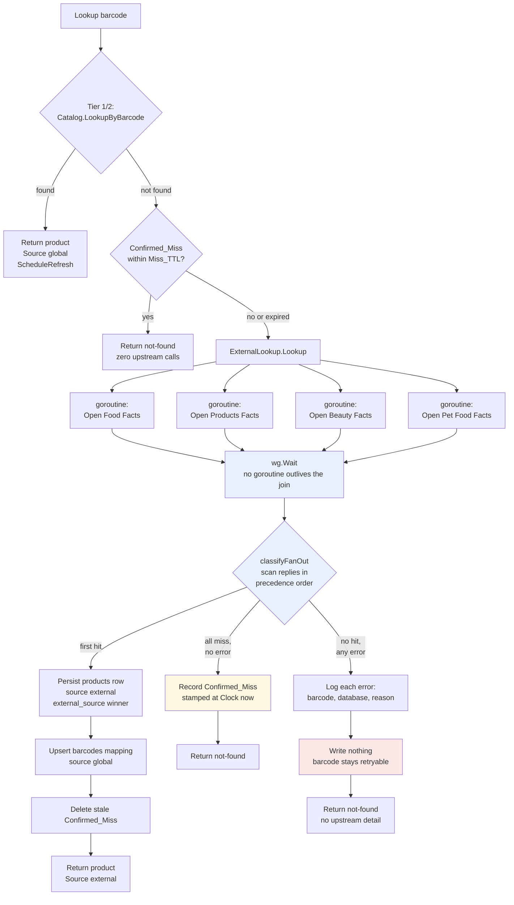

# Design Document

## Overview

Tier 3 of the barcode lookup currently calls one hardcoded host. This design widens it to all four Product Opener databases without changing Tier 1 or Tier 2, without adding a process, and without changing the shape of any existing response beyond one new optional field.

Four changes carry the feature:

1. **One generalized upstream client.** `OpenFoodFactsClient` becomes `ProductOpenerClient`, taking its `External_Source` and base URL at construction. Four instances, identical retry/timeout/decode behavior (Requirement 7).
2. **One `ExternalLookup` value with two entry points.** `Lookup` fans out to all four and returns a three-state outcome (Requirements 1, 2, 6); `LookupIn` targets a single named database for `Refresher` (Requirement 4). One implementation, two narrow consumer-side interfaces.
3. **Provenance on the row.** A nullable `products.external_source` column, carried through `ProductSummary` into every response family and rendered on two frontend surfaces (Requirements 3, 9).
4. **A confirmed-miss table.** A barcode that every database reports unknown, with no error anywhere, is stamped in a dedicated `barcode_misses` table and skipped for `Miss_TTL` (Requirements 5, 6, 8).

The load-bearing invariant throughout: **a hit beats an error, and an error beats a cached miss.** Anything less than a clean all-miss leaves the barcode retryable, so a transient outage cannot harden into a permanent "unknown".

## Architecture

```
                    ┌──────────────────────────────────────┐
   GET /lookup      │          LookupService               │
   POST /scans ────▶│  Tier 1/2  Catalog.LookupByBarcode   │──▶ SQLite
                    │  Miss gate Catalog.GetBarcodeMiss    │
                    │  Tier 3    Upstream.Lookup(barcode)  │
                    └──────────────┬───────────────────────┘
                                   │
                    ┌──────────────▼───────────────────────┐
                    │           ExternalLookup             │
                    │  Lookup(barcode)   → FanOutResult    │  (Tier 3 fan-out)
                    │  LookupIn(src, bc) → *ProductSummary │  (Refresher target)
                    └──┬────────┬────────┬────────┬────────┘
                       │        │        │        │
                  ProductOpenerClient × 4 (one per database, identical config)
                       │        │        │        │
                    world.  world.   world.   world.
                    openfood openproducts openbeauty openpetfood
                    facts.org facts.org  facts.org  facts.org
```

`Refresher` holds the same `*ExternalLookup` value and uses only `LookupIn`. Nothing else changes about its lifecycle: `ScheduleRefresh`'s single-flight map, `context.WithoutCancel` + `BackgroundTimeout`, and `Wait()` are untouched.

### Component responsibilities

| Component | Package | Responsibility |
|---|---|---|
| `ProductOpenerClient` | `product` | One HTTP request against one database; decode, classify 404/status/empty-name as a miss |
| `ExternalLookup` | `product` | Fan out concurrently, classify each reply, apply precedence, return one outcome; also address one database by name |
| `LookupService` | `product` | Three tiers plus the confirmed-miss gate; decide whether a fan-out outcome becomes a recorded miss |
| `Catalog` | `product` | All reads and writes of `products`, `barcodes`, and `barcode_misses` |
| `Refresher` | `product` | Revalidate one external row against the database its provenance names |
| `ProvenanceBadge` | frontend | Map an `External_Source` to a human-readable database name, or render nothing |

## Components and Interfaces

### 1. The generalized client

`internal/product/openfoodfacts.go` becomes `internal/product/product_opener.go`. The type is renamed rather than wrapped:

```go
// ExternalSource identifies which Product Opener database supplied a product's
// field values. The empty value means "not externally sourced, or sourced
// before provenance was recorded".
type ExternalSource string

const (
	ExternalSourceOpenFoodFacts     ExternalSource = "openfoodfacts"
	ExternalSourceOpenProductsFacts ExternalSource = "openproductsfacts"
	ExternalSourceOpenBeautyFacts   ExternalSource = "openbeautyfacts"
	ExternalSourceOpenPetFoodFacts  ExternalSource = "openpetfoodfacts"
)

// ProductOpenerClient queries one Product Opener database. All four databases
// serve the same read API shape and differ only in host, so one type with a
// construction-time base URL covers all of them.
type ProductOpenerClient struct {
	source     ExternalSource
	baseURL    string
	httpClient *http.Client
}

// NewProductOpenerClient builds a client for one database with the standard
// retry transport and a 10 second timeout.
func NewProductOpenerClient(source ExternalSource, baseURL string) *ProductOpenerClient

// NewProductOpenerClientWithHTTPClient builds a client with a caller-supplied
// HTTP client, for tests that stand a fake server in front of a database.
func NewProductOpenerClientWithHTTPClient(source ExternalSource, baseURL string, hc *http.Client) *ProductOpenerClient

// Source reports which database this client queries.
func (c *ProductOpenerClient) Source() ExternalSource

// BaseURL reports the URL this client queries, so a test can confirm a fake
// server stands in for the intended database.
func (c *ProductOpenerClient) BaseURL() string

func (c *ProductOpenerClient) LookupBarcode(ctx context.Context, barcode string) (*ProductSummary, error)
```

The prefixed constant names (`ExternalSourceOpenFoodFacts`, not `SourceOpenFoodFacts`) keep the new value set visually distinct from the existing `SourceExternal` / `SourceUser` constants for `products.source`. Two different columns, two different vocabularies; a shared `Source*` prefix would invite mixing them.

**On keeping a `NewOpenFoodFactsClient` alias:** rejected. There are exactly two call sites — `cmd/server/main.go` and `internal/product/openfoodfacts_test.go` — so the rename is cheap, and retaining an Open Food Facts-specific constructor would assert that OFF is architecturally special when the entire point of the change is that it is not. Both sites move to `NewProductOpenerClient`.

The base URL table is data, not code:

```go
// productOpenerBaseURLs maps each database to its API root. Adding a fifth
// Product Opener database is an entry here plus an entry in
// databasePrecedence.
var productOpenerBaseURLs = map[ExternalSource]string{
	ExternalSourceOpenFoodFacts:     "https://world.openfoodfacts.org/api/v2/product",
	ExternalSourceOpenProductsFacts: "https://world.openproductsfacts.org/api/v2/product",
	ExternalSourceOpenBeautyFacts:   "https://world.openbeautyfacts.org/api/v2/product",
	ExternalSourceOpenPetFoodFacts:  "https://world.openpetfoodfacts.org/api/v2/product",
}

// DefaultProductOpenerClients builds one client per database, each with the
// same retry transport and timeout.
func DefaultProductOpenerClients() map[ExternalSource]*ProductOpenerClient
```

Two behavioral notes inside `LookupBarcode`:

- The request is built with `http.NewRequestWithContext` instead of `httpClient.Get`. Today the `ctx` parameter is accepted and ignored; under a fan-out, a cancelled caller should stop four requests, not zero. The 10 second `http.Client.Timeout` still bounds each request independently (Requirement 7.3).
- `ProductSummary.ID` is set from the *requested* barcode, never from the response's `code` field (Requirement 7.6). This is what makes "an external row's product ID is its barcode" an invariant rather than a hope, and it is the invariant `Refresher` relies on to call `LookupIn(ctx, target, row.ID)` with no second query.
- The miss conditions stay exactly as they are: HTTP 404, `status != 1`, or an empty `product_name` all yield `ErrProductNotFound` (Requirement 7.5). `UnitOfMeasure` stays hardcoded `""` — upstream never supplies one, and `mergeRefresh`'s empty-means-no-opinion rule depends on that staying true.

### 2. Precedence as data

```go
// databasePrecedence resolves a barcode present in more than one upstream
// database. The fan-out iterates this slice and returns the first hit, so
// changing the ordering is changing this literal — there is no branching
// logic to find. Ordered by expected pantry-scan frequency.
var databasePrecedence = []ExternalSource{
	ExternalSourceOpenFoodFacts,
	ExternalSourceOpenProductsFacts,
	ExternalSourceOpenBeautyFacts,
	ExternalSourceOpenPetFoodFacts,
}
```

Requirement 2.2 (the confirmed OFF > OPF pair) and 2.3 (the recommended remainder) are both satisfied by this literal, and reordering it is a one-line edit — which is what the requirements' deliberate split of 2.2 from 2.3 is asking for.

### 3. The fan-out outcome type

Requirement 6.4 needs miss and error to be distinguishable. Today `Lookup`'s Tier 3 collapses both into `LookupResult{}, nil`, which is precisely the information loss that makes a confirmed miss unsafe. A three-state enum replaces the collapse:

```go
// FanOutOutcome classifies a completed Tier-3 fan-out.
type FanOutOutcome string

const (
	// FanOutHit means at least one database supplied a usable record.
	FanOutHit FanOutOutcome = "hit"

	// FanOutConfirmedMiss means every database reported the barcode unknown
	// and none failed. This is the only outcome that may be cached.
	FanOutConfirmedMiss FanOutOutcome = "confirmed_miss"

	// FanOutUnresolved means no database supplied a record and at least one
	// failed, so the barcode's true status is unknown and must be retried.
	FanOutUnresolved FanOutOutcome = "unresolved"
)

// FanOutResult is the single value ExternalLookup reports to LookupService.
type FanOutResult struct {
	Outcome FanOutOutcome

	// Product and Source are set if and only if Outcome is FanOutHit.
	Product *ProductSummary
	Source  ExternalSource
}
```

A three-state enum rather than `(*ProductSummary, bool hadError, error)`: `LookupService` needs exactly one switch, and the illegal state "confirmed miss with an error" cannot be constructed. `FanOutResult` carries no upstream error value at all, which is what makes Requirement 6.6 (no failure detail in the response) structural rather than a discipline the handler has to remember.

### 4. The interface split

One implementation, two narrow interfaces declared at the consuming field — the pattern already used for `LookupService.Catalog` and `Refresher.Catalog`:

```go
// ExternalLookup queries the Product Opener databases. It is the fan-out for
// Tier 3 and the per-database addressable lookup for Refresher.
type ExternalLookup struct {
	// Clients holds one client per database. A database absent from this map
	// is treated as an Upstream_Error, never as an Upstream_Miss: a
	// misconfigured deployment must not be able to manufacture a
	// Confirmed_Miss.
	Clients map[ExternalSource]interface {
		LookupBarcode(ctx context.Context, barcode string) (*ProductSummary, error)
	}
}

// Lookup queries every database concurrently and reports one outcome.
func (l *ExternalLookup) Lookup(ctx context.Context, barcode string) FanOutResult

// LookupIn queries exactly one database, for a revalidation that already
// knows where a row's data came from.
func (l *ExternalLookup) LookupIn(ctx context.Context, source ExternalSource, barcode string) (*ProductSummary, error)
```

`LookupService` and `Refresher` each replace their `OpenFoodFacts` field with an `Upstream` field naming only the method they use:

```go
// LookupService
Upstream interface {
	Lookup(ctx context.Context, barcode string) FanOutResult
}

// Refresher
Upstream interface {
	LookupIn(ctx context.Context, source ExternalSource, barcode string) (*ProductSummary, error)
}
```

The field rename from `OpenFoodFacts` to `Upstream` is deliberate: after this change the field holds four databases, and a field named `OpenFoodFacts` would be actively misleading at every call site. Blast radius is `cmd/server/main.go`, `internal/server/setup_test.go`, `internal/server/test_runner_test.go`, and `internal/server/handler_scan_headless_test.go`.

`main.go` still injects **one value into both**, exactly as today, so there is no risk of the two collaborators drifting apart in configuration:

```go
// UpstreamDatabases is the union both LookupService and Refresher are
// satisfied by, so one value serves both and the DISABLE switch cannot
// disable one without the other.
type UpstreamDatabases interface {
	Lookup(ctx context.Context, barcode string) FanOutResult
	LookupIn(ctx context.Context, source ExternalSource, barcode string) (*ProductSummary, error)
}
```

### 5. Fan-out concurrency and join/persist sequencing

```go
func (l *ExternalLookup) Lookup(ctx context.Context, barcode string) FanOutResult {
	// One slot per database, indexed by precedence position. Each goroutine
	// writes only its own slot, so there is no shared mutable state and no
	// mutex — and because the slots are ordered by precedence, selecting the
	// winner is a scan for the first hit rather than a comparison.
	replies := make([]upstreamReply, len(databasePrecedence))

	var wg sync.WaitGroup
	for i, source := range databasePrecedence {
		client, ok := l.Clients[source]
		if !ok {
			replies[i] = upstreamReply{source: source, err: errNoUpstreamClient}
			continue
		}
		wg.Add(1)
		go func(i int, source ExternalSource, client barcodeLookup) {
			defer wg.Done()
			p, err := client.LookupBarcode(ctx, barcode)
			replies[i] = upstreamReply{source: source, product: p, err: err}
		}(i, source, client)
	}

	// Requirement 10.4: every goroutine this call started has returned before
	// Lookup does. No detached work, no leak, and no need for a Wait() API
	// on the fan-out.
	wg.Wait()

	return classifyFanOut(barcode, replies)
}
```

Three properties fall out of this shape:

- **Concurrency (1.2).** All four requests are in flight simultaneously, so the fan-out costs one slow request rather than four.
- **Determinism (2.4).** Selection reads `replies` in precedence order. Goroutine completion order is irrelevant, and no map is iterated, so the same set of upstream responses always yields the same winner.
- **One writer (1.5).** No goroutine touches the database — the fan-out's collaborator interface has no catalog method to call. Every write happens on the calling goroutine after `wg.Wait()`, sequentially, which is what the `SetMaxOpenConns(1)` SQLite connection requires.

Classification of each reply, then of the fan-out:

```go
func classifyFanOut(barcode string, replies []upstreamReply) FanOutResult {
	sawError := false
	for _, r := range replies {
		switch {
		case r.err == nil && r.product != nil:
			// First hit in precedence order wins; remaining replies are
			// discarded, including errors. A usable answer is a usable answer.
			return FanOutResult{Outcome: FanOutHit, Product: r.product, Source: r.source}
		case errors.Is(r.err, ErrProductNotFound):
			// Upstream_Miss: this database is confident it does not know.
		default:
			// Upstream_Error: one log line naming barcode, database, reason.
			log.Printf("barcode %s lookup against %s failed: %v", barcode, r.source, r.err)
			sawError = true
		}
	}
	if sawError {
		return FanOutResult{Outcome: FanOutUnresolved}
	}
	return FanOutResult{Outcome: FanOutConfirmedMiss}
}
```

Returning on the first hit means a hit outranks an error (Requirement 2.6) and outranks every later miss (Requirement 2.1). An error anywhere with no hit downgrades a would-be confirmed miss to unresolved (Requirement 6.1) — the safety rule the whole feature rests on. Note that the loop logs errors it encounters *before* the winning hit and skips those after it; that asymmetry is acceptable and avoids logging noise for outages that did not affect the answer. If complete error visibility matters more, move the log loop ahead of the selection loop — a two-line change.

### 6. `LookupService.Lookup` order of operations

```go
func (s *LookupService) Lookup(ctx context.Context, barcode, userID string) (LookupResult, error) {
	// ... existing empty-argument validation, unchanged ...

	// Tier 1 & 2: unchanged, including the ScheduleRefresh call and the
	// conservative "global" Source default (Requirement 10.5).
	product, err := s.Catalog.LookupByBarcode(ctx, barcode, userID)
	if err != nil { ... }
	if product != nil { ... return as today ... }

	// Confirmed_Miss gate. This sits AFTER Tier 1/2 deliberately: a user who
	// resolved a flagged entry by creating a product has a barcodes mapping,
	// so Tier 2 answers and the stale miss row is never consulted
	// (Requirement 5.8). Reordering these two steps would break that.
	miss, err := s.Catalog.GetBarcodeMiss(ctx, barcode)
	if err != nil {
		return LookupResult{}, fmt.Errorf("could not check known-unknown barcodes: %w", err)
	}
	if miss != nil && s.now().Sub(*miss) <= s.missTTL() {
		// Same empty result and empty Source a fresh all-miss returns, so the
		// flagged-entry workflow cannot tell the difference (Requirement 5.6).
		return LookupResult{}, nil
	}

	// Tier 3.
	result := s.Upstream.Lookup(ctx, barcode)
	switch result.Outcome {
	case FanOutHit:
		if err := s.persistExternalProduct(ctx, result.Product, result.Source); err != nil {
			return LookupResult{}, err
		}
		return LookupResult{Product: result.Product, Source: "external"}, nil

	case FanOutConfirmedMiss:
		if err := s.Catalog.RecordBarcodeMiss(ctx, barcode, s.now()); err != nil {
			return LookupResult{}, err
		}
		return LookupResult{}, nil

	default: // FanOutUnresolved
		// Write nothing. The barcode stays retryable (Requirements 6.1–6.3)
		// and the caller learns nothing about the upstream failure (6.6).
		return LookupResult{}, nil
	}
}
```

`persistExternalProduct` gains the winning source and one cleanup write:

```go
func (s *LookupService) persistExternalProduct(ctx context.Context, p *ProductSummary, source ExternalSource) error {
	// ... existing GetProductByID / CreateProduct, now with
	//     Source: SourceExternal, ExternalSource: source ...

	// ... existing UpsertBarcodeMapping(ctx, p.ID, p.ID, "global", "") ...

	// A barcode that now resolves will never reach the miss gate again
	// (Tier 2 answers first), so this row is dead data. Deleting it keeps the
	// table from accumulating entries for barcodes that are no longer misses.
	return s.Catalog.DeleteBarcodeMiss(ctx, p.ID)
}
```

New `LookupService` fields:

```go
// MissTTL is the age at which a recorded confirmed miss expires. Defaults to
// defaultMissTTL when zero, so existing literals keep compiling.
MissTTL time.Duration
```

Expiry is `s.now().Sub(*miss) <= s.missTTL()` — subtraction against the injected clock, no sleep and no wall-clock wait anywhere (Requirements 10.2, 10.3).

### 7. Tier 3 fan-out flow



Every database write in the diagram — `J`, `J2`, `J3`, `K` — happens after the `H` join, on the calling goroutine, one at a time.

## Data Models

### `Product` and `ProductSummary`

```go
type Product struct {
	// ... existing fields ...
	Source         string         `json:"source,omitempty"`
	ExternalSource ExternalSource `json:"externalSource,omitempty"`
	RefreshedAt    *time.Time     `json:"refreshedAt,omitempty"`
	NameOverridden bool           `json:"nameOverridden,omitempty"`
}

type ProductSummary struct {
	// ... existing fields ...
	ExternalSource ExternalSource `json:"externalSource,omitempty"`
}
```

A value type with `""` meaning SQL NULL, not `*ExternalSource`. This matches how `Category`, `UnitOfMeasure`, and `ImageURL` already treat empty-versus-NULL through `nullableString`, and `omitempty` then gives Requirement 9.6 (no field at all when absent) for free with no pointer handling at any call site.

Putting the field on `ProductSummary` is what satisfies Requirements 9.1, 9.2, and 9.3 in one place: `ProductSummary` is the shape returned by the barcode lookup, embedded in `scan.ScanEntry.Product`, and embedded in `inventory.Item.Product`. The cost is adding `COALESCE(p.external_source, '')` to the six join queries that build a `ProductSummary`:

| File | Query |
|---|---|
| `internal/product/product.go` | `LookupByBarcode` |
| `internal/inventory/inventory.go` | three item queries (list, by ID, by product) |
| `internal/scan/scan.go` | three scan-entry queries, all scanned by `scanScanEntry` |

`Catalog.ListProducts`, `GetProductByID`, `CreateProduct`, and `SaveRefresh` also gain the column.

### Validation (Requirement 3.7)

```go
// valid reports whether s is storable. The empty value is valid and means
// "no external provenance". SQLite cannot enforce this set with a CHECK
// constraint added via ALTER TABLE, so CreateProduct enforces it in Go,
// exactly as it does for products.source.
func (s ExternalSource) valid() bool
```

`CreateProduct` rejects an invalid value with a user-friendly message before touching the database, following the existing `source` precedent.

### Migration 005

```sql
-- Provenance for the products cache: which Product Opener database supplied a
-- row's field values. SQLite cannot add a CHECK constraint via ALTER TABLE, so
-- the value set {'openfoodfacts','openproductsfacts','openbeautyfacts',
-- 'openpetfoodfacts'} is enforced in Go (product.Catalog.CreateProduct),
-- exactly as products.source is.
--
-- No backfill UPDATE follows, unlike migration 004: the column is nullable with
-- no default, so every pre-existing row is already NULL, which is the correct
-- value. A row cached before this feature existed genuinely has unknown
-- provenance, and Refresher treats NULL as "assume Open Food Facts and stamp it
-- on the next successful revalidation". Guessing a value here would be
-- indistinguishable from a verified one.
ALTER TABLE products ADD COLUMN external_source TEXT;

-- Barcodes every Product Opener database reported unknown, with no upstream
-- error anywhere in the fan-out. Kept in its own table rather than as a
-- sentinel products row so that no existing query has to learn to exclude it.
CREATE TABLE barcode_misses (
    barcode    TEXT PRIMARY KEY,
    checked_at DATETIME NOT NULL
);
```

`ALTER TABLE ... ADD COLUMN` leaves `source`, `refreshed_at`, and `name_overridden` untouched on every existing row (Requirement 3.2) and leaves `external_source` NULL (Requirement 3.3).

### Confirmed_Miss storage: alternatives considered

This is the most consequential choice in the design, because Requirement 5.7 demands that misses stay out of three response families.

**Chosen: a dedicated `barcode_misses` table.** Requirement 5.7 holds by construction — `ListProducts`, `LookupByBarcode`, the three inventory queries, and the three scan queries cannot return a row from a table they do not mention. `Refresher` iterates `products` rows with `source = 'external'` and never sees a miss. Requirement 5.8 falls out for free because the miss gate runs after Tier 1/2. The table is keyed by barcode with a single `checked_at` column, so stamping is one upsert:

```sql
INSERT INTO barcode_misses (barcode, checked_at) VALUES (?, ?)
ON CONFLICT(barcode) DO UPDATE SET checked_at = excluded.checked_at
```

which serves both the first recording (5.1) and the re-stamp of an already-recorded miss (5.5) with no read-modify-write.

**Rejected: a sentinel `products` row.** A miss stored as a `products` row would need an exclusion filter added to nine existing queries, and every query written afterwards would have to remember it — a filter you must not forget is a bug with a delay fuse. Worse, a sentinel with `source = 'external'` is exactly what `Refresher.ScheduleRefresh` and `Refresher.Refresh` look for, so every cached miss would become a revalidation target, re-fanning-out the very requests the cache exists to prevent. Any variant that makes the sentinel non-external instead re-breaks Requirement 5.7 for `ListProducts`.

**Rejected: a column on `barcodes`.** `barcodes.product_id` is `NOT NULL REFERENCES products(id)`, so a miss row needs either a fabricated product ID or a schema relaxation, and `LookupByBarcode` inner-joins `products`, so the miss would still need filtering there. The `UNIQUE (barcode, source, user_id)` constraint also puts a miss row in direct competition with a real `global` mapping for the same barcode, which is precisely the Requirement 5.8 case that must not be ambiguous.

### `Catalog` methods for misses

Requirement 5's storage is a data-access concern, and AGENTS.md allows exactly one data-access type per feature package. `product` already has `Catalog`, which owns the `products` and `barcodes` tables — a barcode's known-unknown status belongs to the same lookup concern, so the three methods go on `Catalog` rather than introducing a second type:

```go
// RecordBarcodeMiss stamps barcode as confirmed-unknown at checkedAt,
// inserting or re-stamping as needed.
func (r *Catalog) RecordBarcodeMiss(ctx context.Context, barcode string, checkedAt time.Time) error

// GetBarcodeMiss returns when barcode was last confirmed unknown, or nil if
// there is no such record.
func (r *Catalog) GetBarcodeMiss(ctx context.Context, barcode string) (*time.Time, error)

// DeleteBarcodeMiss removes any confirmed-unknown record for barcode.
func (r *Catalog) DeleteBarcodeMiss(ctx context.Context, barcode string) error
```

### `Refresher` targeting by provenance

```go
func (r *Refresher) Refresh(ctx context.Context, productID string) (RefreshOutcome, error) {
	// ExternalLookupEnabled gate, GetProductByID, nil check, and the
	// source != SourceExternal early return are all unchanged. That early
	// return is what satisfies Requirement 4.5: a user row queries nothing
	// and changes nothing.

	// A Legacy_External_Row has no provenance, so it is revalidated against
	// Open Food Facts — the only database it could have come from, since it
	// was cached before any other was queried (Requirement 4.3).
	target := row.ExternalSource
	if target == "" {
		target = ExternalSourceOpenFoodFacts
	}

	// Exactly one database, named by the row (Requirements 4.1, 4.2). The
	// external-row invariant "product ID is the barcode" still holds, so
	// row.ID is passed directly with no barcodes query (Requirement 7.6).
	upstream, err := r.Upstream.LookupIn(ctx, target, row.ID)
	if err != nil {
		// Both failure paths are unchanged: a miss and a transport error each
		// stamp refreshed_at via MarkRefreshed, which writes refreshed_at and
		// nothing else. That is what satisfies Requirement 4.7 — name,
		// category, unit_of_measure, image_url, and external_source all
		// survive a miss precisely because this path never writes them.
		// Broadening MarkRefreshed would regress that.
		...
	}

	merged := mergeRefresh(*row, *upstream)

	// One unconditional write covers two requirements: for a row that already
	// had provenance this is a no-op rewrite of the same value (3.6), and for
	// a Legacy_External_Row it is the stamp that records where the data came
	// from (4.4).
	merged.ExternalSource = target

	if err := r.Catalog.SaveRefresh(ctx, merged, now); err != nil { ... }
	return classify(*row, merged), nil
}
```

`SaveRefresh` adds `external_source = ?` to its `UPDATE`. `classify` is untouched: provenance is not a field a client sees change, so stamping it does not by itself make an outcome `updated`.

The `ExternalLookupEnabled` gate and its reasoning stay exactly as documented today. That comment explains that inferring "disabled" from an `ErrProductNotFound` value would stamp `refreshed_at` and suppress real revalidation for a full TTL. The same reasoning now applies with more force, because a disabled fan-out must also not manufacture a `Confirmed_Miss` — see the disabled stub below.

`mergeRefresh` is unchanged. Its empty-means-no-opinion rule is what Requirement 4.7 depends on and what keeps `UnitOfMeasure` from being blanked by an upstream that never supplies one.

## Configuration wiring

`cmd/server/main.go`:

```go
// defaultMissTTL is used when PRODUCT_MISS_TTL is unset, empty, or unparseable.
const defaultMissTTL = 7 * 24 * time.Hour

// productMissTTL reads PRODUCT_MISS_TTL and returns the age at which a
// confirmed-miss record expires and the barcode becomes eligible for another
// fan-out. Shaped exactly like productCacheTTL: an unparseable value is logged
// and defaulted rather than failing startup, and a value that parses is used as
// given even if non-positive, since 0s is a legitimate "never cache a miss"
// debugging setting.
func productMissTTL() time.Duration {
	raw := os.Getenv("PRODUCT_MISS_TTL")
	if raw == "" {
		return defaultMissTTL
	}
	ttl, err := time.ParseDuration(raw)
	if err != nil {
		log.Printf("invalid PRODUCT_MISS_TTL %q, using default of %s", raw, defaultMissTTL)
		return defaultMissTTL
	}
	return ttl
}
```

The variable name `PRODUCT_MISS_TTL` is a design choice — the requirements name the concept but not the variable. It sits alongside `PRODUCT_CACHE_TTL` and reads as the same family.

```go
externalLookupEnabled := os.Getenv("DISABLE_EXTERNAL_PRODUCT_LOOKUP") != "true"

var upstream product.UpstreamDatabases = product.NewExternalLookup(product.DefaultProductOpenerClients())
if !externalLookupEnabled {
	upstream = disabledExternalLookup{}
}

refresher := &product.Refresher{
	Catalog:               catalog,
	Upstream:              upstream,
	TTL:                   productCacheTTL(),
	ExternalLookupEnabled: externalLookupEnabled,
}
lookupService := &product.LookupService{
	Catalog:   catalog,
	Upstream:  upstream,
	Refresher: refresher,
	MissTTL:   productMissTTL(),
}
```

One `upstream` value in both collaborators, as today, so the disable switch cannot half-apply. `PRODUCT_CACHE_TTL` remains a single `Refresher.TTL` with no per-database variant, which is Requirement 8.4.

```go
// disabledExternalLookup stands in for the Product Opener databases when
// DISABLE_EXTERNAL_PRODUCT_LOOKUP is set. It reports FanOutUnresolved rather
// than FanOutConfirmedMiss for the same reason Refresher consults
// ExternalLookupEnabled directly rather than inferring it from an error value:
// reporting a confirmed miss would record a Confirmed_Miss for every barcode
// scanned while lookup is off, and each of those barcodes would then stay
// unresolvable for a full Miss_TTL after lookup is switched back on.
type disabledExternalLookup struct{}

func (disabledExternalLookup) Lookup(context.Context, string) product.FanOutResult {
	return product.FanOutResult{Outcome: product.FanOutUnresolved}
}

// LookupIn preserves the existing stub's behavior. Refresher never reaches it
// while lookup is disabled, because ExternalLookupEnabled short-circuits first.
func (disabledExternalLookup) LookupIn(context.Context, product.ExternalSource, string) (*product.ProductSummary, error) {
	return nil, product.ErrProductNotFound
}
```

Requirements 8.1 and 8.2 both follow: no database is queried, and no miss is recorded. Requirement 8.3 is the unchanged `Refresher` gate. Requirement 8.8 holds because nothing here adds a process, scheduler, or listener — the fan-out is four goroutines inside an existing request.

## API response plumbing

No new endpoint and no changed status code. One optional field appears on the `ProductSummary` embedded in three existing response families:

| Endpoint | Path to the field | Requirement |
|---|---|---|
| `GET /api/products/lookup` | `$.product.externalSource` | 9.1 |
| `GET /api/scans` | `$[*].product.externalSource` | 9.2 |
| `GET /api/inventory` | `$[*].item.product.externalSource` | 9.3 |
| `GET /api/products` | `$[*].externalSource` | 3.4, 3.5 (verification surface) |

`omitempty` means the field is absent, not `null`, for a product with no provenance — which is what the frontend's "render nothing" branch keys on.

## Frontend

`frontend/src/types/index.ts`:

```ts
// The Product Opener database that supplied a product's field values.
export type ExternalSource =
  | 'openfoodfacts'
  | 'openproductsfacts'
  | 'openbeautyfacts'
  | 'openpetfoodfacts';

export interface ProductSummary {
  // ... existing fields ...
  // Which upstream database supplied this product's name, category, and
  // thumbnail. Omitted from the JSON response for user-created products and
  // for rows cached before provenance was recorded.
  externalSource?: ExternalSource;
}
```

`frontend/src/api/client.ts` needs no change: the field is additive and optional, and the client returns these types structurally.

One shared component owns the value-to-name mapping and the absent case, so the two surfaces cannot drift:

```tsx
// frontend/src/components/product/ProvenanceBadge.tsx

// Human-readable names for the four Product Opener databases.
const DATABASE_NAMES: Record<ExternalSource, string> = {
  openfoodfacts: 'Open Food Facts',
  openproductsfacts: 'Open Products Facts',
  openbeautyfacts: 'Open Beauty Facts',
  openpetfoodfacts: 'Open Pet Food Facts',
};

export interface ProvenanceBadgeProps {
  externalSource?: ExternalSource;
}

export const ProvenanceBadge = ({ externalSource }: ProvenanceBadgeProps) => {
  const name = externalSource === undefined ? undefined : DATABASE_NAMES[externalSource];
  // No provenance, or a value this build does not recognize, renders nothing
  // rather than a badge reading "undefined".
  if (name === undefined) {
    return null;
  }
  return (
    <Badge size="xs" variant="light" aria-label={`Product data from ${name}`}>
      {name}
    </Badge>
  );
};
```

Placement:

- **`ScanEntryCard.tsx`** — beneath the existing `Barcode: {entry.barcode}` line in the header stack, rendered as `<ProvenanceBadge externalSource={entry.product?.externalSource} />`. It sits with the other product metadata rather than with the `Flagged` status badge, because it describes the data's origin, not the entry's state.
- **`ItemRow.tsx`** — in the `Stack` under the category `Text`, as `<ProvenanceBadge externalSource={item.product.externalSource} />`. `ItemRow` is `memo`-wrapped and the new prop is read off the existing `inventoryItem` object, so no memo boundary changes.

Requirement 9.7 is the `aria-label`, which gives the badge an accessible name that includes the database name plus the context a sighted user gets from position ("Product data from Open Food Facts"). The visible text remains the bare database name, so the accessible name is a superset of the visual label rather than a contradiction of it. Requirement 9.6 is the `return null` branch — and it also covers an unrecognized value, so a future fifth database shipped to the backend before the frontend cannot render a broken badge.

`FlaggedEntryResolver` needs no change: a flagged entry has no product, so there is no provenance to show.

## Error Handling

| Condition | Behavior | Requirement |
|---|---|---|
| One database transport failure, another hits | Hit returned and persisted; failure logged only | 2.6, 6.5 |
| All databases fail | Not-found returned, nothing written, all four logged, barcode retryable | 6.1, 6.2, 6.3 |
| Mixed misses and failures, no hit | Treated as all-failed: no `Confirmed_Miss` recorded | 6.1 |
| Upstream failure detail | Never reaches the response; `FanOutResult` carries no error value | 6.6 |
| Database absent from `Clients` map | Classified as an error, never a miss | 6.1 (safety) |
| `GetBarcodeMiss` read failure | Surfaced as a lookup error with a user-friendly message | — |
| `RecordBarcodeMiss` write failure | Surfaced as a lookup error; the barcode simply stays uncached | — |
| Invalid `external_source` on write | `CreateProduct` rejects before touching the database | 3.7 |
| Invalid `PRODUCT_MISS_TTL` | Logged once, defaulted to 7 days; startup continues | 8.7 |
| Background revalidation failure | Logged, not surfaced — unchanged | — |

Error messages stay user-friendly and free of function names, per the repo convention.

## Testing Strategy

### Generalizing the fakes to four databases (Requirement 10.1)

`fakeOpenFoodFacts` is already exactly the right shape for one database — an in-memory store plus per-barcode error and blocking seeding, all mutex-guarded because background goroutines call it concurrently. It is renamed `fakeProductOpener` with no behavioral change, and four instances are created.

The fan-out over those four is **production code, not a second implementation**:

```go
// fakeUpstream substitutes a fake at the HTTP boundary of each database while
// keeping the real ExternalLookup, so tests exercise the production
// precedence, classification, and join logic rather than a test copy of it.
type fakeUpstream struct {
	*product.ExternalLookup
	databases map[product.ExternalSource]*fakeProductOpener
}

// Database returns the fake standing in for one Product Opener database, so a
// test can express a hit from one and a miss or error from another.
func (u *fakeUpstream) Database(source product.ExternalSource) *fakeProductOpener
```

Embedding `*product.ExternalLookup` gives `fakeUpstream` both `Lookup` and `LookupIn` for free. A test that seeds `Database(ExternalSourceOpenBeautyFacts)` and asserts a winner is testing `classifyFanOut` and `databasePrecedence` as shipped.

`testEnv` keeps `OpenFoodFacts` pointing at the Open Food Facts fake, so every existing `env.OpenFoodFacts.Seed(...)` and `env.OpenFoodFacts.CallCount(...)` call compiles unchanged and means the same thing:

```go
type testEnv struct {
	T             *testing.T
	DB            *sql.DB
	ProductStore  *product.Catalog
	OpenFoodFacts *fakeProductOpener // the Open Food Facts database
	Upstream      *fakeUpstream      // all four, for per-database seeding
	Refresher     *product.Refresher
	Clock         *fakeClock
	Res           *http.Response
}
```

`setupTestWithDB` currently returns six values and would need seven. It changes signature to `(http.Handler, testEnv)` instead, building and returning the fully populated `testEnv`. Three in-package call sites move: `runHandlerTests`, `newExternalHarness`, and the ad-hoc handler builder in `handler_scan_headless_test.go`. This stops the signature growing with every feature and keeps the "same `Refresher`, same `fakeClock`" contract its doc comment already explains.

`exchanges()` builds a second `LookupService` against the same state; it must be given the same `Upstream`, `Refresher`, `Now`, **and** `MissTTL`. A missing `MissTTL` there would silently default to zero and make every cached-miss assertion in an `afterRequest` sequence pass for the wrong reason — worth a comment alongside the existing one about reusing `env.Refresher`.

### Where each kind of test lives

**API tests in `internal/server/` (the default).** `handlerTestCase` / `runHandlerTests` with `afterRequest: exchanges(...)`, covering: the fan-out asking all four databases, precedence selection across database subsets, hit-beats-error, provenance appearing in all three response families, confirmed-miss suppression and expiry via `env.Clock.Advance`, the user-created-product-wins case, refresh targeting by provenance, and the legacy-row fallback and stamp.

Direct `env.DB` queries stay a last resort. Two cases genuinely need them, following the precedent already set for `refreshed_at`:

- `barcode_misses.checked_at` precision — no endpoint exposes it. The *behavior* (no upstream call within the TTL, a call after it) is fully assertable through HTTP, so the DB read is only for the timestamp itself and may be skipped entirely.
- Requirement 5.7's negative case for `barcode_misses` is better asserted positively through HTTP: record misses, then confirm `GET /api/products`, `GET /api/products/lookup`, and `GET /api/inventory` contain nothing for those barcodes.

**Unit tests in `internal/product/`, only where API tests cannot reach:**

- `ProductOpenerClient` response decoding and the three miss conditions, using `httptest` servers and real clients (Requirement 7.7's `BaseURL()` accessor exists for this). The existing `openfoodfacts_test.go` mock-transport table generalizes to run against all four sources.
- Identical timeout and retry configuration across `DefaultProductOpenerClients()`.
- `ExternalSource.valid()` rejection of out-of-set values.
- `productMissTTL()` parsing and invalid-value logging.
- `classifyFanOut`'s three outcomes, and goroutine-count equality across a fan-out (Requirement 10.4).

**Not tested:** internal error paths an API caller cannot trigger — `sql.DB` failures, `SaveRefresh` write errors, malformed rows. Reproducible errors are tested: a missing `barcode` query parameter, an invalid `external_source`, an unparseable duration.

**Frontend:** Vitest component tests for `ProvenanceBadge` (four values render the mapped name and carry the accessible name; absent and unrecognized values render nothing), plus one test each on `ScanEntryCard` and `ItemRow` confirming the badge appears with a provenance-carrying product and does not otherwise.

**Property test configuration:** minimum 100 iterations per property test, each tagged `Feature: open-products-facts-lookup, Property {n}: {property text}`.

Run `./scripts/test-coverage.sh` after each task to enforce and update the coverage threshold.

## Correctness Properties

*A property is a characteristic or behavior that should hold true across all valid executions of a system — essentially, a formal statement about what the system should do. Properties serve as the bridge between human-readable specifications and machine-verifiable correctness guarantees.*

### Property 1: Every database is asked

*For any* barcode that reaches Tier 3, each of the four Product Opener databases receives exactly one lookup request for that barcode.

**Validates: Requirements 1.1**

### Property 2: A lone hit resolves with source external

*For any* barcode and *for any* single Product Opener database holding a record for it, the lookup returns that record with `Source` equal to `external`.

**Validates: Requirements 1.4**

### Property 3: The precedence-earliest hit wins, every time

*For any* non-empty subset of the Product Opener databases holding distinguishable records for the same barcode, the lookup returns the record from the subset member that appears earliest in `databasePrecedence`, discards the rest, creates no flagged scan entry, and returns that same selection on every repetition of the fan-out.

**Validates: Requirements 2.1, 2.2, 2.3, 2.4, 2.5**

### Property 4: A hit outranks a concurrent failure

*For any* pair of a hitting database and a failing database, the lookup returns the hit and persists the resolved product.

**Validates: Requirements 2.6**

### Property 5: The persisted external row keeps its pre-feature shape

*For any* product resolved from a Product Opener database, the persisted `products` row has `source` equal to `external` and its `barcodes` mapping has source `global`, and for an Open Food Facts resolution every persisted value matches the pre-feature value apart from the added `external_source`.

**Validates: Requirements 1.6, 10.6**

### Property 6: Provenance round-trips through storage and every response family

*For any* Product Opener database that resolves a barcode, the recorded `external_source` equals that database, and it is present on the product in the barcode lookup response, the scan queue response, and the inventory response.

**Validates: Requirements 3.4, 9.1, 9.2, 9.3**

### Property 7: A user-created product has no provenance

*For any* product created through the product API, the stored row and every response carry no `external_source` value.

**Validates: Requirements 3.5**

### Property 8: A refresh never rewrites provenance

*For any* external row with provenance D, every refresh outcome leaves that row's `external_source` equal to D.

**Validates: Requirements 3.6**

### Property 9: Only the four values are storable

*For any* string that is neither empty nor one of the four defined `External_Source` values, creating a product with that value fails and writes no row.

**Validates: Requirements 3.7**

### Property 10: A refresh queries exactly the database its row names

*For any* external row, a refresh issues exactly one upstream request, against the database named by that row's `external_source`, or against Open Food Facts when the row has none, and against no other database.

**Validates: Requirements 4.1, 4.2, 4.3**

### Property 11: A successful refresh of a legacy row records where the data came from

*For any* external row with no provenance, a refresh that receives an upstream record leaves that row reporting `openfoodfacts`.

**Validates: Requirements 4.4**

### Property 12: A user row is inert under refresh

*For any* user row, a refresh queries no Product Opener database and leaves every field value unchanged.

**Validates: Requirements 4.5**

### Property 13: A refresh hit merges as it did before the feature

*For any* pair of a cached external row and an upstream record, the refreshed row takes each upstream field only where upstream supplied a non-empty value, stamps `refreshed_at`, and reports the outcome the pre-feature classification would report.

**Validates: Requirements 4.6**

### Property 14: A refresh miss preserves every cached field

*For any* external row whose upstream database reports the barcode unknown, that row's `name`, `category`, `unit_of_measure`, `image_url`, and `external_source` are unchanged after the refresh.

**Validates: Requirements 4.7**

### Property 15: A confirmed miss suppresses the fan-out for its whole window

*For any* barcode unknown to all four databases with no failure anywhere, and *for any* elapsed time no greater than `Miss_TTL`, a subsequent lookup returns not-found and issues no upstream request.

**Validates: Requirements 5.1, 5.2**

### Property 16: A re-confirmed miss restarts its window

*For any* barcode, a confirmed miss followed by expiry, a second all-miss fan-out, and an elapsed time under `Miss_TTL` yields a lookup that issues no upstream request.

**Validates: Requirements 5.5**

### Property 17: A barcode that becomes known stops being a miss

*For any* Product Opener database, a barcode with an expired confirmed miss that the database now resolves is persisted and returned by every subsequent lookup.

**Validates: Requirements 5.3, 5.4**

### Property 18: A cached miss is indistinguishable from a fresh unknown

*For any* barcode, the lookup result returned from a cached confirmed miss has the same shape and the same `Source` value as the result returned for a barcode freshly found unknown upstream, and a scan of that barcode still produces a flagged entry.

**Validates: Requirements 5.6**

### Property 19: Confirmed misses are invisible to every response

*For any* set of barcodes with recorded confirmed misses, the product list response, the barcode lookup response, and the inventory response contain no entry for any of them.

**Validates: Requirements 5.7**

### Property 20: A user-created product outranks a cached miss

*For any* barcode with a recorded confirmed miss, creating a product for that barcode makes every subsequent lookup return that product with no upstream request.

**Validates: Requirements 5.8**

### Property 21: A failure anywhere keeps the barcode retryable

*For any* non-empty set of failing databases with no hit anywhere, the lookup returns not-found, creates no `products` row, records no confirmed miss, and the next lookup of that barcode queries all four databases again.

**Validates: Requirements 6.1, 6.2, 6.3**

### Property 22: Upstream failure detail never reaches the caller

*For any* upstream failure message, the lookup response contains no part of that message.

**Validates: Requirements 6.6**

### Property 23: The wire format round-trips through the client

*For any* product record and *for any* of the four databases, serializing that record as a Product Opener response and decoding it through a client pointed at that database yields a summary carrying the response's `product_name`, `categories`, and `image_front_small_url` values.

**Validates: Requirements 7.4**

### Property 24: Three conditions each mean unknown

*For any* response that is an HTTP 404, or carries a `status` value other than 1, or carries an empty `product_name`, the client reports the barcode unknown rather than returning a record.

**Validates: Requirements 7.5**

### Property 25: A resolved product's ID is the requested barcode

*For any* barcode and *for any* response resolving it, including a response whose own `code` field differs, the returned summary's ID equals the requested barcode.

**Validates: Requirements 7.6**

### Property 26: Disabling upstream lookup disables it completely and cheaply

*For any* barcode, with external lookup disabled, no Product Opener database is queried and no confirmed miss is recorded, so re-enabling lookup resolves that barcode immediately with no clock advance.

**Validates: Requirements 8.1, 8.2**

### Property 27: Disabling upstream lookup freezes every row

*For any* product row, a refresh with external lookup disabled leaves every field value and `refreshed_at` unchanged.

**Validates: Requirements 8.3**

### Property 28: One cache TTL governs every provenance

*For any* `External_Source` value and *for any* row age, staleness is decided by the single configured `PRODUCT_CACHE_TTL` and not by which database supplied the row.

**Validates: Requirements 8.4**

### Property 29: A duration setting round-trips, and a non-duration defaults

*For any* duration, configuring the miss TTL with that duration's string form yields that duration, and *for any* string no duration parser accepts, the configured miss TTL is 7 days and the offending value is logged once.

**Validates: Requirements 8.6, 8.7**

### Property 30: A provenance label names its database accessibly

*For any* of the four `External_Source` values and *for either* the scan card or the inventory row, the surface displays a label whose text and accessible name both name the corresponding Product Opener database.

**Validates: Requirements 9.4, 9.5, 9.7**

### Property 31: No provenance, no label

*For any* product with no `External_Source` value, neither the scan card nor the inventory row displays a provenance label.

**Validates: Requirements 9.6**

### Property 32: A fan-out leaves nothing running

*For any* combination of hits, misses, and failures across the four databases, the goroutine count after the fan-out returns equals the count before it started.

**Validates: Requirements 10.4**

### Property 33: The fast tiers are untouched

*For any* barcode resolvable from a user override or the local catalog, the lookup returns the same result shape and `Source` value it returned before this feature, and queries no Product Opener database.

**Validates: Requirements 10.5**
