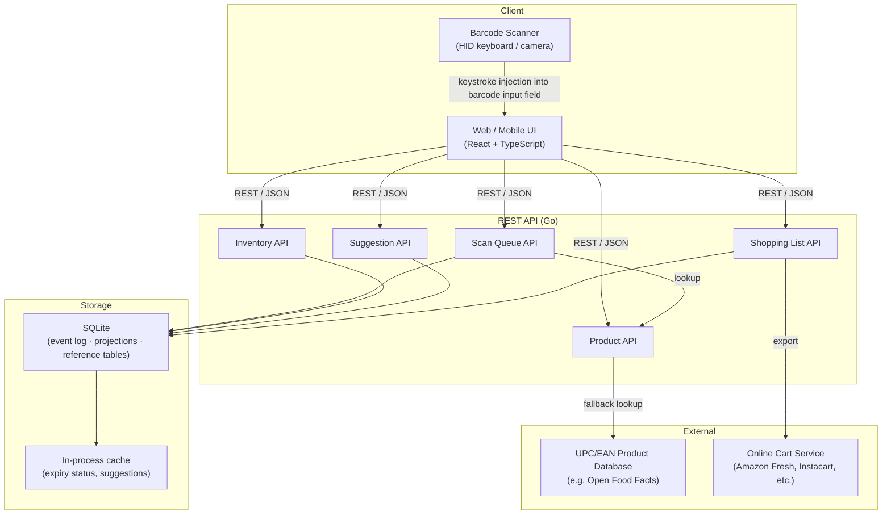

# Design Document: Pantry Management

## Overview

The Pantry Management app is a full-stack web application with a mobile-responsive UI, designed to track household pantry inventory at the individual item-instance level. Users interact with it primarily through a mobile browser (while physically handling groceries) and occasionally through a desktop browser (for review and planning tasks). A lightweight barcode scanner device (USB HID keyboard emulator or Bluetooth keyboard) can feed barcodes directly into the app via keystroke injection, with no special driver needed.

The system is organized around a central **scan queue** that decouples the physical act of scanning from the cognitive task of reviewing and classifying each scan. This lets a user quickly move through stocking or consuming items without pausing to make decisions, then review the queue at a later, more convenient time.

### Key Design Decisions

1. **Instance-based inventory model**: Each physical unit is a separate database record (`ItemInstance`), not an aggregate count. This supports per-unit expiration tracking and use-oldest-first ordering without additional bookkeeping.

2. **Scan queue as coordination layer**: The scanner (device or camera) only writes to the scan queue. Only the review UI commits scans to inventory. This keeps the two concerns fully separated and supports deferred review.

3. **Local product overrides take precedence**: The app maintains a per-user product override table that is checked before the global UPC/EAN database, allowing users to correct mis-categorized barcodes and handle private-label items.

4. **Consumption rate drives suggestions**: Target quantity suggestions are derived from rolling consumption history (stock-outs over time), so they naturally adapt as usage patterns change.

5. **Shopping list is derived, not canonical**: The shopping list is computed from the difference between target quantities and current instance counts. Manual additions and cart-export state are layered on top of this derived view.

6. **Event-sourced storage on SQLite**: The database layer uses an append-only event log pattern enforced at the application layer (no UPDATE/DELETE on the events table). SQLite is the storage engine: it is a single-file, zero-config, zero-server-process database that runs on any home server hardware, is trivial to back up (copy one file), and is more than sufficient for household-scale write loads. SQLite is single-writer by design, which is fine for a household app where concurrent writes are rare.

---

## Architecture



### Technology Choices

| Layer | Technology | Rationale |
|---|---|---|
| Frontend | React + TypeScript | Wide mobile browser support, rich component ecosystem, type safety |
| Backend | Go | Performance, strong standard library, easy binary deployment |
| Database | SQLite | Single-file, zero-config, no server process; sufficient for household-scale usage; trivial to back up (copy one file); runs on any home server hardware |
| External UPC DB | Open Food Facts API | Free, open, comprehensive, no API key required |
| CSS | Tailwind CSS | Responsive mobile-first design |

---

## Components and Interfaces

### Frontend Components

```
src/
  components/
    scanner/
      BarcodeInputField      # keystroke-capture input; auto-submits on barcode terminator
      CameraScanner          # camera-based scanning via BarcodeDetector API
      ScanDirectionToggle    # pre-select stock-in / stock-out; auto-clears after 5 min idle
    queue/
      ScanQueuePage          # lists pending + flagged entries
      ScanEntryCard          # single entry: product name, barcode, timestamp, direction, count, expiry
      BatchReviewPanel       # select multiple entries, apply direction + expiry
      FlaggedEntryResolver   # product search + create form for unrecognized barcodes
      DisambiguationModal    # shown when barcode matches multiple products
    inventory/
      InventoryPage          # grouped by item, Needs Attention section at top
      ItemRow                # item name, category, instance count, warning badge
      ItemInstanceList       # instances sorted use-oldest-first; per-instance expiry badge
      AddInstanceModal       # manual instance add form
    suggestions/
      SuggestionPanel        # per-item suggestion card with reasoning text
    shopping/
      ShoppingListPage       # auto-generated + manual items
      CartExportButton       # triggers cart export API call
```

### Backend API Endpoints

#### Scan Queue

| Method | Path | Description |
|---|---|---|
| POST | `/api/scans` | Add a new scan entry (from scanner input) |
| GET | `/api/scans?status=pending` | List scan queue entries |
| GET | `/api/scans?status=flagged` | List flagged entries |
| GET | `/api/scans/history` | Read-only scan history |
| PATCH | `/api/scans/{id}` | Update direction, unit count, expiry, or resolution |
| POST | `/api/scans/{id}/commit` | Commit a scan entry to inventory |
| POST | `/api/scans/batch-commit` | Commit multiple entries with shared attributes |

#### Products

| Method | Path | Description |
|---|---|---|
| GET | `/api/products/lookup?barcode={barcode}` | Look up product by barcode (overrides → DB → UPC external) |
| GET | `/api/products` | List known products |
| POST | `/api/products` | Create a new product |
| PUT | `/api/products/{id}` | Update a product |
| POST | `/api/products/overrides` | Create or update a product override for a barcode |

#### Inventory

| Method | Path | Description |
|---|---|---|
| GET | `/api/inventory` | List all items with instance counts and attention flags |
| GET | `/api/inventory/{itemId}/instances` | List item instances for a specific item |
| POST | `/api/inventory/{itemId}/instances` | Manually add an instance |
| DELETE | `/api/inventory/instances/{instanceId}` | Manually remove an instance |

#### Suggestions

| Method | Path | Description |
|---|---|---|
| GET | `/api/suggestions/{itemId}` | Get target quantity suggestion for an item |
| POST | `/api/items/{itemId}/target-quantity` | Accept or set target quantity |

#### Shopping List

| Method | Path | Description |
|---|---|---|
| GET | `/api/shopping-list` | Get current shopping list (derived + manual) |
| POST | `/api/shopping-list/items` | Manually add an item |
| DELETE | `/api/shopping-list/items/{id}` | Remove a manual item |
| PATCH | `/api/shopping-list/items/{id}` | Mark item as purchased |
| POST | `/api/shopping-list/export` | Export to configured cart service |

---

## Data Models

### Core Database Schema

The schema runs on SQLite. The three-layer storage model is:

1. **Event log** (`scan_entries`, `consumption_events`) — append-only records enforced at the application layer.
2. **Projection tables** (`item_instances`, `shopping_list_items`) — derived state kept in sync by the application after each commit.
3. **Reference tables** (`products`, `barcodes`, `items`, `cart_integrations`) — slowly-changing master data.

```sql
-- Product: describes a type of item (identified by barcode or name)
CREATE TABLE products (
    id          TEXT PRIMARY KEY,   -- UUID stored as text
    name        TEXT NOT NULL,
    category    TEXT,
    unit_of_measure TEXT,
    created_at  DATETIME NOT NULL DEFAULT CURRENT_TIMESTAMP
);

-- Barcode: maps a barcode value to a product
-- Multiple barcodes can map to the same product; a barcode may have no product yet
-- NULL user_id represents a global (non-user-specific) entry.
-- SQLite does not support partial unique indexes in all versions, so uniqueness is
-- enforced with a plain UNIQUE constraint. NULL values are considered distinct by
-- SQLite's UNIQUE constraint, so multiple rows with user_id IS NULL for the same
-- (barcode, source) pair would be allowed. To avoid this, global entries use an
-- empty string '' for user_id instead of NULL.
CREATE TABLE barcodes (
    barcode         TEXT NOT NULL,
    product_id      TEXT NOT NULL REFERENCES products(id),
    source          TEXT NOT NULL CHECK (source IN ('global', 'user_override')),
    user_id         TEXT NOT NULL DEFAULT '',   -- '' for global entries, user UUID for overrides
    created_at      DATETIME NOT NULL DEFAULT CURRENT_TIMESTAMP,
    UNIQUE (barcode, source, user_id)
);

-- Item: a user's specific instance of interest in a product, with target quantity
CREATE TABLE items (
    id              TEXT PRIMARY KEY,
    user_id         TEXT NOT NULL,
    product_id      TEXT NOT NULL REFERENCES products(id),
    target_quantity INTEGER,   -- NULL until set
    created_at      DATETIME NOT NULL DEFAULT CURRENT_TIMESTAMP,
    UNIQUE (user_id, product_id)
);

-- ItemInstance: a single physical unit tracked in the pantry
CREATE TABLE item_instances (
    id              TEXT PRIMARY KEY,
    item_id         TEXT NOT NULL REFERENCES items(id),
    stock_in_at     DATETIME NOT NULL,
    expires_at      DATETIME,        -- NULL means no tracked expiration
    removed_at      DATETIME,        -- NULL means still in pantry
    removal_reason  TEXT CHECK (removal_reason IN ('consumed', 'expired', 'manual')),
    created_at      DATETIME NOT NULL DEFAULT CURRENT_TIMESTAMP
);

-- ScanEntry: the scan queue and scan history (append-only event log)
CREATE TABLE scan_entries (
    id              TEXT PRIMARY KEY,
    user_id         TEXT NOT NULL,
    barcode         TEXT NOT NULL,
    scanned_at      DATETIME NOT NULL,
    direction       TEXT CHECK (direction IN ('stock_in', 'stock_out')),   -- NULL = pending
    unit_count      INTEGER NOT NULL DEFAULT 1,
    expires_at      DATETIME,
    status          TEXT NOT NULL DEFAULT 'pending'
                    CHECK (status IN ('pending', 'flagged', 'committed', 'cancelled')),
    product_id      TEXT REFERENCES products(id),   -- NULL until resolved/committed
    committed_at    DATETIME,
    created_at      DATETIME NOT NULL DEFAULT CURRENT_TIMESTAMP
);

-- ConsumptionEvent: records each stock-out for suggestion analytics (append-only)
CREATE TABLE consumption_events (
    id              TEXT PRIMARY KEY,
    item_id         TEXT NOT NULL REFERENCES items(id),
    consumed_at     DATETIME NOT NULL,
    scan_entry_id   TEXT REFERENCES scan_entries(id)
);

-- ShoppingListItem: manual additions and purchase state
CREATE TABLE shopping_list_items (
    id              TEXT PRIMARY KEY,
    user_id         TEXT NOT NULL,
    item_id         TEXT NOT NULL REFERENCES items(id),
    quantity        INTEGER NOT NULL,
    source          TEXT NOT NULL CHECK (source IN ('manual', 'auto')),
    purchased_at    DATETIME,
    created_at      DATETIME NOT NULL DEFAULT CURRENT_TIMESTAMP
);

-- CartIntegration: configuration for online cart export
CREATE TABLE cart_integrations (
    id              TEXT PRIMARY KEY,
    user_id         TEXT NOT NULL UNIQUE,
    service_type    TEXT NOT NULL,   -- 'amazon_fresh', 'instacart', 'generic'
    config_json     TEXT NOT NULL,   -- JSON stored as text; service-specific credentials/settings (encrypted at app layer)
    enabled         INTEGER NOT NULL DEFAULT 1,  -- SQLite has no BOOLEAN; 1=true, 0=false
    updated_at      DATETIME NOT NULL DEFAULT CURRENT_TIMESTAMP
);
```

### API Data Transfer Objects (TypeScript)

```typescript
// Scan entry as returned by the API
interface ScanEntry {
  id: string;
  barcode: string;
  scannedAt: string;           // ISO 8601
  direction: 'stock_in' | 'stock_out' | null;
  unitCount: number;
  expiresAt: string | null;
  status: 'pending' | 'flagged' | 'committed' | 'cancelled';
  product: ProductSummary | null;
}

interface ProductSummary {
  id: string;
  name: string;
  category: string | null;
  unitOfMeasure: string | null;
}

// Item as returned by the inventory API
interface InventoryItem {
  id: string;
  product: ProductSummary;
  instanceCount: number;
  targetQuantity: number | null;
  nearExpiryCount: number;
  expiredCount: number;
  needsAttention: boolean;
}

// Individual physical unit
interface ItemInstance {
  id: string;
  itemId: string;
  stockInAt: string;     // ISO 8601
  expiresAt: string | null;
  expiryStatus: 'ok' | 'near_expiry' | 'expired';
}

// Shopping list entry (derived or manual)
interface ShoppingListEntry {
  id: string;
  item: InventoryItem;
  quantity: number;
  source: 'auto' | 'manual';
  purchasedAt: string | null;
  hasTargetQuantity: boolean;
}

// Target quantity suggestion
interface TargetQuantitySuggestion {
  itemId: string;
  suggestedQuantity: number;
  reasoning: string;
  consumptionEventCount: number;
  dataInsufficient: boolean;   // true when fewer than 3 events
}
```

### Key Business Logic

#### Scan Direction Auto-Clear

The ScanDirectionToggle component tracks the timestamp of the last scan. A client-side timer fires when 5 minutes have elapsed since the last recorded scan and clears the pre-selected direction. The server also records this idle-clear event so the history is accurate.

#### Expiry Status Calculation

```
expiryStatus(instance, now, warningDays = 7):
  if instance.expiresAt is null:
    return 'ok'
  daysUntilExpiry = (instance.expiresAt - now) / ONE_DAY
  if daysUntilExpiry < 0:
    return 'expired'
  if daysUntilExpiry <= warningDays:
    return 'near_expiry'
  return 'ok'
```

#### Consumption Rate Suggestion Algorithm

```
suggestTargetQuantity(itemId):
  events = consumptionEvents(itemId), sorted by consumed_at asc
  if len(events) < 3:
    return { dataInsufficient: true }
  
  // Calculate median inter-consumption interval
  intervals = [events[i].consumed_at - events[i-1].consumed_at for i in 1..len(events)-1]
  medianInterval = median(intervals)   // days between uses
  
  // We want enough stock to last a configurable restock horizon (default: 14 days)
  restockHorizon = 14  // days
  rawSuggestion = ceil(restockHorizon / medianInterval)
  
  // Apply a safety buffer (+1 to account for timing uncertainty)
  suggestion = rawSuggestion + 1
  
  reasoning = "Based on {len(events)} consumption events over {totalDays} days,
               you use this item approximately every {medianInterval} days.
               To maintain a {restockHorizon}-day supply, we suggest a target of {suggestion}."
  
  return { suggestedQuantity: suggestion, reasoning, dataInsufficient: false }
```

#### Use-Oldest-First Ordering

When committing a stock-out, if the user has not selected a specific instance, the API selects:

```sql
SELECT * FROM item_instances
WHERE item_id = ? AND removed_at IS NULL
ORDER BY expires_at ASC NULLS LAST
LIMIT 1
```

Instances without an expiration date sort after those with one, so dated instances are consumed first.

#### Shopping List Derivation

```
shoppingList(userId):
  items = all items for user where target_quantity IS NOT NULL
  derived = [
    { item, quantity: item.target_quantity - currentInstanceCount(item) }
    for item in items
    if currentInstanceCount(item) < item.target_quantity
  ]
  manual = shopping_list_items where user_id = userId and source = 'manual' and purchased_at IS NULL
  return merge(derived, manual), deduplicating by item_id (manual overrides derived quantity)
```

---

## Correctness Properties

*A property is a characteristic or behavior that should hold true across all valid executions of a system — essentially, a formal statement about what the system should do. Properties serve as the bridge between human-readable specifications and machine-verifiable correctness guarantees.*

### Property 1: Scan entry data integrity

*For any* barcode string and timestamp submitted to the scan queue, the created scan entry SHALL persist the barcode value and timestamp exactly as provided, with status `pending` and no pre-set scan direction unless one was explicitly provided.

**Validates: Requirements 1.1, 1.2**

### Property 2: Scan direction propagation

*For any* pre-selected scan direction and any sequence of scans recorded within 5 minutes of the last scan, every resulting scan entry SHALL carry that direction; and for any scan recorded more than 5 minutes after the previous scan, the direction SHALL NOT be applied automatically.

**Validates: Requirements 1.4, 1.5**

### Property 3: Scan queue chronological ordering

*For any* collection of scan entries in the queue, the list returned to the user SHALL be ordered ascending by `scanned_at` timestamp (oldest first).

**Validates: Requirements 1.7**

### Property 4: Batch update applies to all selected entries

*For any* subset of pending scan entries selected for batch review and any combination of direction and expiration date applied, every entry in the selected subset SHALL have its direction and expiration date updated to the new values, and no entry outside the subset SHALL be modified.

**Validates: Requirements 1.10**

### Property 5: Stock-in commit creates exactly N instances

*For any* scan entry with direction `stock_in` and unit count N ≥ 1, committing that entry SHALL create exactly N new item instances for the corresponding item, each with the scan entry's stock-in timestamp and expiration date, and the item's total instance count SHALL increase by exactly N.

**Validates: Requirements 1.11**

### Property 6: Stock-out commit removes the use-oldest-first instance

*For any* item with at least one instance and a stock-out commit where no specific instance is selected, the item instance with the earliest expiration date (use-oldest-first) SHALL be the one removed, and the item's total instance count SHALL decrease by exactly 1.

**Validates: Requirements 1.12, 1.9, 2.3**

### Property 7: Committed scan entry is preserved in history

*For any* scan entry that is committed, the entry SHALL no longer appear in the pending scan list and SHALL appear in the read-only scan history with its original barcode, timestamp, direction, unit count, and expiration date all unchanged.

**Validates: Requirements 1.14**

### Property 8: Flagged entry resolution creates override and transitions to pending

*For any* flagged scan entry resolved by selecting or creating a product, a product override SHALL be created associating the entry's barcode with the chosen product, and the entry's status SHALL transition from `flagged` to `pending`.

**Validates: Requirements 1.17, 1.19**

### Property 9: Expiry status is consistent with dates and warning period

*For any* item instance with an expiration date and any current time, the computed expiry status SHALL satisfy: `expired` when `expiresAt < now`; `near_expiry` when `0 ≤ (expiresAt − now) ≤ warningPeriod`; and `ok` otherwise. Instances with no expiration date SHALL always have status `ok`.

**Validates: Requirements 2.8, 2.9**

### Property 10: Needs Attention section contains exactly the right items

*For any* inventory state, the Needs Attention section SHALL contain exactly those items that have at least one instance with status `near_expiry` or `expired`, and SHALL contain no items that have only `ok` instances.

**Validates: Requirements 2.10, 2.11**

### Property 11: Inventory search filter returns exactly matching items

*For any* search query string and inventory state, the filtered result SHALL contain every item whose name or category includes the query string (case-insensitive), and SHALL exclude every item whose name and category both do not include the query string.

**Validates: Requirements 2.4**

### Property 12: Shopping list gap quantity is always correct

*For any* item with a target quantity T and a current instance count C, if C < T the item SHALL appear in the shopping list with quantity exactly (T − C); if C ≥ T the item SHALL NOT appear in the auto-generated portion of the shopping list.

**Validates: Requirements 4.1, 4.2, 4.8**

### Property 13: Purchasing a shopping list item does not modify inventory

*For any* inventory state and any shopping list item marked as purchased, the inventory instance count for every item SHALL remain exactly the same as before the purchase action.

**Validates: Requirements 4.6**

### Property 14: Suggestion returns data-insufficient for fewer than 3 consumption events

*For any* item with 0, 1, or 2 recorded consumption events, the suggestion engine SHALL always return `dataInsufficient: true` and SHALL NOT return a numeric suggested quantity. For any item with 3 or more recorded consumption events, the suggestion engine SHALL return a numeric suggested quantity and a non-empty reasoning string.

**Validates: Requirements 3.1, 3.2, 3.5**

---

## Error Handling

### Scan Queue Errors

| Error | Handling |
|---|---|
| Barcode unreadable | Display manual entry prompt (Req 1.3) |
| Barcode matches no product | Create flagged entry, show visual indicator (Req 1.15) |
| Barcode matches multiple products | Show disambiguation modal before queuing (Req 1.18) |
| Stock-out on zero inventory | Warn user before committing (Req 1.13) |
| Commit fails (network/DB error) | Display error toast; entry remains pending |

### Inventory Errors

| Error | Handling |
|---|---|
| Remove non-existent instance | Return HTTP 404; display error message in UI (Req 2.7) |
| Add instance with invalid date | Return HTTP 422 with field-level validation error |

### Shopping List / Cart Export Errors

| Error | Handling |
|---|---|
| Cart export partial failure | Notify user of failed items; retain in shopping list (Req 4.10) |
| Cart integration not configured | Disable export button; show setup prompt |
| Network timeout on export | Treat as failure; allow retry |

### External Product Database Errors

| Error | Handling |
|---|---|
| UPC database unreachable | Fall back to local DB only; display offline notice |
| UPC database returns no result | Create flagged entry as if product not found |
| UPC database rate-limited | Retry with exponential backoff (max 3 attempts) |

---

## Testing Strategy

### Dual Testing Approach

This system uses two complementary testing strategies:

1. **Unit / integration tests** — verify specific examples, edge cases, and error conditions using concrete inputs and expected outputs.
2. **Property-based tests** — verify universal properties (listed in the Correctness Properties section above) across many generated inputs. Each property test runs a minimum of 100 iterations.

### Property-Based Testing

The backend business logic (scan commit, expiry calculation, shopping list derivation, suggestion engine, use-oldest-first ordering, product lookup) is well-suited to property-based testing because:
- Behavior varies meaningfully with input (different expiry dates, unit counts, consumption histories).
- The functions are pure or near-pure (given a database state, the output is deterministic).
- 100+ iterations will surface edge cases that manual examples miss.

**Library**: [`pgregory.net/rapid`](https://github.com/pgregory-net/rapid) (Go) for backend properties. Frontend component properties using [`fast-check`](https://github.com/dubzzz/fast-check) (TypeScript).

**Tag format**: Each property test MUST include a comment:
```
// Feature: pantry-management, Property N: <property text>
```

**Minimum iterations**: 100 per property test (rapid default; configurable via `rapid.Settings`).

### Unit / Integration Tests

- Each API endpoint has at minimum one happy-path and one error-path integration test.
- Scan direction auto-clear timer logic is tested with mocked clocks.
- External UPC database integration is tested with a mock HTTP server.
- Cart export is tested with a mock cart service.
- Disambiguation and flagged-entry flows are covered by UI integration tests.
- **Database integration tests** use an in-memory SQLite database (`:memory:`) or a temporary file; the schema is applied via migration scripts before each test run. No Docker or external process is required — SQLite's in-process nature makes test setup trivial.

### Frontend Testing

- Component unit tests with React Testing Library for all major components.
- `fast-check` property tests for shopping list derivation logic and expiry status utilities.
- End-to-end tests (Playwright) cover the core scan → review → commit flow.
