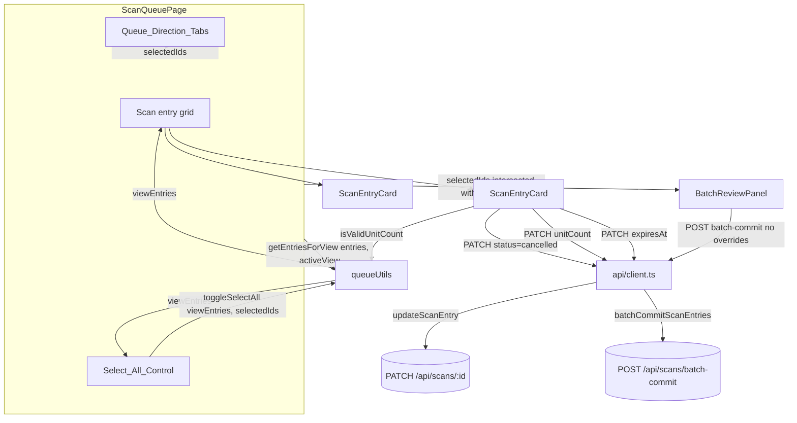

# Design Document

## Overview

This feature extends the three existing scan-queue components — `ScanQueuePage`, `ScanEntryCard`, `BatchReviewPanel` — and their shared `queueUtils.ts` helpers. No backend changes are made. Every mutation routes through the two API functions that already exist in `frontend/src/api/client.ts`: `updateScanEntry` (`PATCH /api/scans/{id}`) for per-card removal, unit-count edits, and expiration-date edits, and `batchCommitScanEntries` (`POST /api/scans/batch-commit`) for the batch approve action.

The change touches presentation and interaction logic only. `ScanEntry`, `BatchCommitResponse`, and the other shapes in `frontend/src/types/index.ts` are reused unmodified — no fields are added because every value this feature reads or writes (`status`, `direction`, `unitCount`, `expiresAt`) already exists on `ScanEntry`.

## Architecture



No new components are introduced. `queueUtils.ts` gains pure functions used by `ScanQueuePage` (select-all, view filtering) and `ScanEntryCard` (unit-count validation); everything else is local component state and existing `api/client.ts` calls. `Queue_Direction_Tabs` sits above the grid and `Select_All_Control` in `ScanQueuePage`, narrowing `entries` down to `viewEntries` before either of those two consumes it — so the select-all and grid logic already documented below is unchanged in shape, only fed a pre-filtered list.

## Components and Interfaces

### `queueUtils.ts` additions

```typescript
// A Batch_Eligible_Entry is a pending entry whose direction has been
// determined. Requirement 3.
export const isBatchEligible = (entry: ScanEntry): boolean =>
  entry.status === 'pending' && entry.direction !== null;

// Computes the next batch selection when the Select_All_Control is
// activated. If every displayed Batch_Eligible_Entry is currently selected,
// deselects all of them; otherwise selects all of them. Ids belonging to
// entries that are not Batch_Eligible_Entry are left untouched either way.
// Requirements 3.2, 3.3, 3.4.
export const toggleSelectAll = (entries: ScanEntry[], selectedIds: string[]): string[] => {
  const eligibleIds = entries.filter(isBatchEligible).map((entry) => entry.id);
  const allEligibleSelected = eligibleIds.length > 0 && eligibleIds.every((id) => selectedIds.includes(id));
  const preserved = selectedIds.filter((id) => !eligibleIds.includes(id));
  return allEligibleSelected ? preserved : [...new Set([...preserved, ...eligibleIds])];
};

// A confirmed unit-count entry is only accepted when it is a positive whole
// number. Requirement 2.6.
export const isValidUnitCount = (value: number): boolean =>
  Number.isInteger(value) && value >= 1;

// Partitions displayed entries into the two Queue_Direction_Tabs views.
// Stock_In_View is exactly `direction === 'stock_in'`; Stock_Out_View is the
// catchall for `direction === 'stock_out'` and `direction === null`, so a
// flagged/undirected entry always has somewhere to be reviewed. Every entry
// belongs to exactly one view — this is a total partition, not a filter that
// can drop entries. Requirements 9.1, 9.2, 9.3, 9.4.
export type QueueView = 'stock_in' | 'stock_out';

export const getEntriesForView = (entries: ScanEntry[], view: QueueView): ScanEntry[] =>
  view === 'stock_in'
    ? entries.filter((entry) => entry.direction === 'stock_in')
    : entries.filter((entry) => entry.direction === 'stock_out' || entry.direction === null);
```

These are pure and reuse the existing `ScanEntry`/status types from `frontend/src/types/index.ts` — no new types are declared beyond the `QueueView` union, which mirrors `ScanDirection` but is a distinct concept (a view, not a direction actually recorded on any entry).

`toggleSelectAll` and `isBatchEligible` are unchanged by this feature — `ScanQueuePage` now calls `toggleSelectAll(viewEntries, selectedIds)` instead of `toggleSelectAll(entries, selectedIds)`, where `viewEntries` is the result of `getEntriesForView(entries, activeView)`. Because `toggleSelectAll` already preserves the selection state of every id not present in its `entries` argument (Property 2), passing it a view-filtered list rather than the full list is sufficient, on its own, to satisfy Requirement 10's view-scoping (10.1, 10.2, 10.3) — no changes to `toggleSelectAll` itself are needed.

### `ScanQueuePage.tsx` changes

- Adds `Queue_Direction_Tabs` (a Mantine `Tabs`) above the `Select_All_Control` and grid, holding `activeView` state that always initializes to `'stock_out'` and is never read from or written to `localStorage` (Requirement 8.2, 8.3 — "no persistence" is satisfied simply by never persisting it; `useState<QueueView>('stock_out')` is re-run fresh on every mount):

```typescript
const [activeView, setActiveView] = useState<QueueView>('stock_out');

const handleViewChange = (value: string | null) => {
  if (value !== 'stock_in' && value !== 'stock_out') return;
  setActiveView(value);
  setSelectedIds([]); // Requirement 11: clears the batch selection on every tab switch
};

<Tabs value={activeView} onChange={handleViewChange}>
  <Tabs.List>
    <Tabs.Tab value="stock_in">Stock in</Tabs.Tab>
    <Tabs.Tab value="stock_out">Stock out</Tabs.Tab>
  </Tabs.List>
</Tabs>
```

  `Tabs`'s `onChange` fires only when the user activates a tab (not on the initial render), so `handleViewChange` clearing `selectedIds` unconditionally is safe — it never runs on mount, matching Requirement 11's "WHEN a user activates ... tab" phrasing rather than firing on every render.

- Derives `viewEntries` once per render and uses it everywhere `entries` was previously used for eligibility/selection/rendering, per Requirement 9 and 10:

```typescript
const viewEntries = getEntriesForView(entries, activeView);
const eligibleEntries = viewEntries.filter(isBatchEligible);
const allEligibleSelected =
  eligibleEntries.length > 0 && eligibleEntries.every((entry) => selectedIds.includes(entry.id));
```

- The `Select_All_Control` (a Mantine `Checkbox`) is rendered above the grid, wired to `toggleSelectAll` with `viewEntries` rather than `entries`:

```tsx
<Checkbox
  label="Select all for approval"
  aria-label="Select all eligible scans for batch approval"
  checked={allEligibleSelected}
  disabled={eligibleEntries.length === 0}
  onChange={() => setSelectedIds((current) => toggleSelectAll(viewEntries, current))}
/>
```

- The grid maps over `viewEntries` instead of `entries`, so `ScanEntryCard` is only ever rendered — and therefore only ever editable via its `Batch_Selection_Checkbox`, unit-count editor, or expiration-date input — for entries within the Active_View (Requirement 10.4):

```tsx
<SimpleGrid cols={{ base: 1, sm: 2, lg: 3 }} spacing="xs">
  {viewEntries.map((entry) => (
    <ScanEntryCard key={entry.id} entry={entry} /* ...unchanged props... */ />
  ))}
</SimpleGrid>
```

- `BatchReviewPanel` receives `selectedIds` intersected with `viewEntries`'s ids rather than the raw `selectedIds`, so an approve action can never reach outside the Active_View even if some future change reintroduces a selection that spans views (Requirement 10.5):

```typescript
const viewEntryIds = new Set(viewEntries.map((entry) => entry.id));
<BatchReviewPanel
  selectedIds={selectedIds.filter((id) => viewEntryIds.has(id))}
  onComplete={() => { setSelectedIds([]); void loadQueue(); }}
/>
```

- The remove flow (Requirement 1.3) reuses the existing `onChanged={() => void loadQueue()}` prop already passed to `ScanEntryCard` — no new plumbing is needed since a cancel `PATCH` is handled the same way a commit `PATCH` is today (card reports it changed, page reloads the queue, `mergeScanEvent`/list re-render drops the entry through the normal `pending`/`flagged` fetch). This is unaffected by the tab split: `loadQueue` still fetches the full `pending`/`flagged` set, and `viewEntries` re-derives from whichever entries remain.

### `ScanEntryCard.tsx` changes

Renamed internal state to match the "approve" terminology (`committing`/`commitError` → `approving`/`approveError`) and new local state for the three inline editors and the change indicator:

```typescript
export interface ScanEntryCardProps {
  entry: ScanEntry;
  selected: boolean;
  itemId?: string;
  onSelectedChange: (selected: boolean) => void;
  onChanged: () => void;
}
```

The prop signature is unchanged — every new behavior (remove, unit-count edit, expiry edit, change indicator) is internal to the card and reports back through the existing `onChanged` callback, exactly like the current commit flow.

Key internal pieces:

1. **Remove control** (Requirement 1) — a `Button variant="subtle" color="red"` (or `ActionIcon`, matching the card's existing `size="xs"` button convention) shown when `entry.status === 'pending' || entry.status === 'flagged'`. On click: `updateScanEntry(entry.id, { status: 'cancelled' })`, then `onChanged()` on success; on failure, sets a local error state and leaves the card in place (no optimistic removal).

2. **Unit-count editor** (Requirement 2) — shown when `entry.status === 'pending'`: a decrement `Button`, the current count (a `NumberInput` sized to fit, matching the pattern already used in `SuggestionPanel`/`ShoppingListPage`), and an increment `Button`.
   - Increment/decrement call `updateScanEntry(entry.id, { unitCount: entry.unitCount + 1 })` / `- 1` directly (no local draft needed, since the displayed count comes from `entry.unitCount` and `onChanged()` triggers a reload).
   - The decrement button is `disabled={entry.unitCount <= 1}`.
   - The `NumberInput` keeps local draft state so keystrokes don't PATCH per character; on blur (or Enter, via `onKeyDown`), if the draft parses to an integer and `isValidUnitCount(draft)`, it PATCHes `{ unitCount: draft }`; otherwise the draft resets to `entry.unitCount` without sending a request (Requirement 2.6).
   - Failures show an inline error and leave `entry.unitCount` as the source of truth (no local mutation occurs outside the draft, so "retain the previously confirmed unit count" falls out naturally from re-deriving the draft from `entry.unitCount`).

3. **Expiration date input** (Requirement 7) — shown when `entry.status === 'pending'`, a `TextInput type="date"` mirroring `BatchReviewPanel`'s current field, defaulting to `''` when `entry.expiresAt === null` (using the existing `formatExpiryDate`/ISO conventions already in `queueUtils.ts`). On blur, if the value changed, calls `updateScanEntry(entry.id, { expiresAt: expiryDateToISOString(value) })` and `onChanged()` on success.

4. **Batch_Selection_Checkbox** (Requirement 5) — same `Checkbox` as today but with `label` removed and `aria-label="Select scan for batch approval"` added:

```tsx
<Checkbox
  size="xs"
  aria-label="Select scan for batch approval"
  checked={selected}
  onChange={(event) => onSelectedChange(event.currentTarget.checked)}
/>
```

5. **Approve control and error copy** (Requirement 4) — `Button` text changes from `Commit scan` to `Approve scan`, gets an explicit `aria-label="Approve scan"`, and the catch branch's fallback message changes from `'Unable to commit scan.'` to `'Unable to approve scan.'`. The handler itself still calls the existing `commitScanEntry` API function (its name is a backend/client-API detail, not UI copy, so it is not renamed).

6. **Change indicator** (Requirement 6) — a boolean `showChangeIndicator` driven by one `useEffect`:

```typescript
const [showChangeIndicator, setShowChangeIndicator] = useState(true);

useEffect(() => {
  setShowChangeIndicator(true);
  const timer = setTimeout(() => setShowChangeIndicator(false), 600);
  return () => clearTimeout(timer);
}, [entry.unitCount]);
```

Because `ScanEntryCard` is keyed by `entry.id` in `ScanQueuePage`'s `.map`, a newly-arrived entry mounts a fresh component instance, so this same effect firing on mount covers "a new card appeared" (Requirement 6.2) with no extra prop, and firing again whenever `entry.unitCount` changes covers Requirement 6.1. The `prefers-reduced-motion` check happens at render time via `matchMedia`, matching how `test-setup.ts` already stubs that API for Mantine:

```typescript
const prefersReducedMotion = () =>
  typeof window.matchMedia === 'function' && window.matchMedia('(prefers-reduced-motion: reduce)').matches;

const changeIndicatorClass = !showChangeIndicator
  ? undefined
  : prefersReducedMotion()
    ? 'scan-entry-card--changed-static'
    : 'scan-entry-card--changed-animated';

<Card component="article" withBorder padding="sm" className={changeIndicatorClass} aria-label={`Scan ${entry.barcode}`}>
```

Both CSS classes are added to `frontend/src/index.css` (the app's existing global stylesheet — no component ever imports its own CSS file today, so this keeps the established convention rather than introducing CSS Modules):

```css
.scan-entry-card--changed-animated {
  animation: scan-entry-changed-flash 600ms ease-out;
}

.scan-entry-card--changed-static {
  background-color: var(--accent-bg);
}

@keyframes scan-entry-changed-flash {
  0% { background-color: var(--accent-bg); }
  100% { background-color: transparent; }
}
```

`scan-entry-card--changed-static` gives the reduced-motion path a persisted (non-fading) highlight for the same ~600ms window controlled by the `useEffect` timer, rather than an animated keyframe — satisfying Requirement 6.4 without a second timing mechanism.

### `BatchReviewPanel.tsx` changes

The direction `NativeSelect` and expiration-date `TextInput` are removed — every selected entry now carries its own `direction` and `expiresAt`, set on its own card. The panel becomes a heading plus a single approve button:

```typescript
export const BatchReviewPanel = ({ selectedIds, onComplete }: BatchReviewPanelProps) => {
  const [error, setError] = useState('');
  const [submitting, setSubmitting] = useState(false);

  const handleApprove = async () => {
    setSubmitting(true);
    setError('');
    try {
      const response = await batchCommitScanEntries({
        scanEntryIds: selectedIds,
        commit: true,
      });
      onComplete(response);
    } catch (requestError) {
      setError(requestError instanceof Error ? requestError.message : 'Unable to approve selected scans.');
    } finally {
      setSubmitting(false);
    }
  };

  return (
    <Stack component="section" aria-labelledby="batch-review-heading" gap="xs">
      <h2 id="batch-review-heading">Approve scans</h2>
      <Group align="end" gap="xs">
        <Button
          size="xs"
          aria-label={`Approve ${selectedIds.length} selected scans`}
          onClick={() => void handleApprove()}
          disabled={selectedIds.length === 0}
          loading={submitting}
        >
          Approve {selectedIds.length} selected
        </Button>
      </Group>
      {error !== '' && (
        <Alert color="red" py="xs">
          {error}
        </Alert>
      )}
    </Stack>
  );
};
```

`batchCommitScanEntries`'s `BatchCommitInput` type in `client.ts` already declares `direction`, `unitCount`, and `expiresAt` as optional (`?:`); omitting them from the call, as shown above, is exactly what Requirement 7.5 asks for — no change to `client.ts` or its types is needed.

## Data Models

No data model changes. This feature reads and writes only fields already present on `ScanEntry` (`status`, `unitCount`, `expiresAt`) via the existing `UpdateScanEntryInput` and `BatchCommitInput` shapes in `frontend/src/api/client.ts`, and introduces no new backend routes, request bodies, or response fields beyond what those two functions already send.

## Error Handling

| Action | Failure handling |
|---|---|
| Remove (`status: 'cancelled'` PATCH) | Inline `Alert` on the card with a message containing "remove"/"unable"; entry stays in the displayed list (Requirement 1.4). |
| Unit-count PATCH (increment, decrement, or direct entry) | Inline `Alert`; displayed count reverts to `entry.unitCount` since no optimistic local mutation is kept beyond the input draft (Requirement 2.7). |
| Expiration-date PATCH | Inline `Alert`, mirroring the unit-count failure path; the date input's draft resets to the entry's current `expiresAt`. |
| Approve scan (single) | Existing `commitError`-style `Alert`, copy updated to say "approve" (Requirement 4.6). |
| Approve selected (batch) | Existing `error` `Alert` on `BatchReviewPanel`, copy updated to say "approve" (Requirement 4.6). |
| Invalid direct unit-count entry (`< 1` or non-integer) | Rejected client-side before any request is sent; draft resets to `entry.unitCount` (Requirement 2.6) — this is a validation rejection, not a request failure. |

All error paths follow the pattern already established in this file: catch the thrown `ApiError`/`Error`, display its `message` (falling back to a friendly default) in a `color="red"` `Alert`, and leave prior displayed state untouched.

## Correctness Properties

*A property is a characteristic or behavior that should hold true across all valid executions of a system-essentially, a formal statement about what the system should do. Properties serve as the bridge between human-readable specifications and machine-verifiable correctness guarantees.*

### Property 1: Unit count validity

For any number, `isValidUnitCount` SHALL return `true` if and only if that number is an integer greater than or equal to one, and confirming any input value for which it returns `false` SHALL leave the scan entry's unit count unchanged.

**Validates: Requirements 2.6**

### Property 2: Select-all toggles exactly the eligible entries and preserves the rest

For any list of displayed scan entries and any current batch selection, `toggleSelectAll` SHALL produce a selection in which every displayed Batch_Eligible_Entry is selected if and only if at least one Batch_Eligible_Entry was unselected beforehand, and in which the selected/unselected state of every entry that is not a Batch_Eligible_Entry is unchanged from the input selection. Because `ScanQueuePage` calls `toggleSelectAll` with the Active_View's filtered entry list (`viewEntries`) rather than the full entry list, this same property — applied to that filtered list — is also what guarantees the Select_All_Control's view-scoping: every entry outside the Active_View is, by construction, outside `toggleSelectAll`'s `entries` argument, so it falls under "every entry that is not a Batch_Eligible_Entry [within the argument list]" and is left untouched.

**Validates: Requirements 3.2, 3.3, 3.4, 10.1, 10.2, 10.3**

### Property 3: Every entry belongs to exactly one queue view

For any list of scan entries, `getEntriesForView` SHALL partition them so that an entry appears in the Stock_In_View result if and only if its `direction` field equals `stock_in`, appears in the Stock_Out_View result if and only if its `direction` field equals `stock_out` or is null, and appears in exactly one of the two results — never both, never neither.

**Validates: Requirements 9.1, 9.2, 9.3, 9.4**

## Testing Strategy

Following the repository's existing conventions in `frontend/src/components/queue/`:

- **`queueUtils.test.ts`**: property tests (via `fast-check`, ≥100 iterations, tagged per the format used for Properties 9/10 already in this file) for Property 1 (`isValidUnitCount`), Property 2 (`toggleSelectAll`, including a case generating a mix of in-view and out-of-view entries to exercise the 10.1–10.3 validation this property now also carries), and Property 3 (`getEntriesForView`, generating entries with all three `direction` values — `stock_in`, `stock_out`, `null` — and asserting the two returned lists are disjoint and together cover the input). Plus a couple of concrete unit examples for readability (e.g. `isValidUnitCount(0) === false`, `isValidUnitCount(1) === true`).
- **`ScanEntryCard.test.tsx`**: RTL example tests, one per acceptance criterion in Requirements 1, 2 (examples 2.1–2.5, 2.7), 4 (single-scan copy), 5, 6 (using `vi.useFakeTimers()` / `vi.advanceTimersByTime(600)` the same way `ScanDirectionToggle.test.tsx` already tests its own timer, and `vi.stubGlobal('matchMedia', ...)` to exercise both the animated and reduced-motion branches), and 7.
- **`BatchReviewPanel.test.tsx`**: RTL example tests for the renamed heading/button/aria-label (Requirement 4) and for the batch commit request body omitting `direction`/`unitCount`/`expiresAt` (Requirement 7.4, 7.5).
- **`ScanQueuePage.test.tsx`**: RTL example tests for the Select_All_Control's rendered state and for the remove-then-reload flow (Requirement 1.3), reusing the existing `FakeEventSource`/`fetch` mocking pattern already in this file. Adds tab-switch example tests: `Stock_Out_View` is the Active_View on initial mount (8.2) and remains so on a fresh mount even after a prior instance was switched to `Stock_In_View` (8.3, exercised via unmount/remount rather than any persisted storage); activating each tab renders only that view's entries (8.4, 8.5, 9.1–9.4, backed by Property 3 for the filtering logic itself); switching tabs clears `selectedIds`, verified by selecting an entry, switching tabs, switching back, and asserting nothing is selected (11.1, 11.2); and an approve action only ever includes entries from the Active_View (10.5).

Unit tests stay focused on one example per distinct branch (per this repo's `AGENTS.md` testing guidance); the three property tests carry the burden of exhaustive input coverage for the functions with universally-quantified correctness rules.
